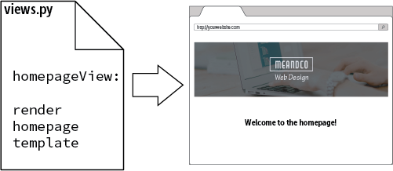

# 1 Introducción

## 1.1. Introduciendo Django

El gran software de código abierto casi siempre se construye porque uno o más desarrolladores inteligentes tenían un problema que resolver y no había ninguna solución viable o rentable disponible. Django no es una excepción. Adrian y Jacob hace tiempo que se retiraron del proyecto, pero los fundamentos de lo que los llevó a crear Django siguen vivos. Es esta sólida base de experiencia en el mundo real la que ha hecho a Django tan exitoso como lo es. En reconocimiento a su contribución, es mejor que les dejemos presentar a Django con sus propias palabras (editado y reformateado a partir del libro original).

### 1.1.1. Por **Adrian Holovaty** y **Jacob Kaplan-Moss**  (Diciembre 2009)

*En los primeros días, los desarrolladores web escribían cada página a mano. Actualizar un sitio web significaba editar el HTML; un rediseño implicaba rehacer cada una de las páginas, una a una. A medida que los sitios web crecían y se volvían más ambiciosos, se hizo evidente rápidamente que ese enfoque era tedioso, lento y, en última instancia, insostenible.*

*Un grupo de hackers emprendedores del Centro Nacional de Aplicaciones de Supercomputación (la NCSA, donde se desarrolló Mosaic, el primer navegador web gráfico) resolvió este problema dejando que el servidor web generara programas externos que pudieran generar HTML de forma dinámica. Llamaron a este protocolo la Interfaz de Entrada Común (CGI Common Gateway Interface), y cambió la web para siempre. Ahora es difícil imaginar lo que debe haber sido una revelación CGI: en lugar de tratar las páginas HTML como simples archivos en el disco, CGI permite pensar en sus páginas como recursos generados dinámicamente a pedido.*

*El desarrollo de CGI marcó el comienzo de la primera generación de sitios web dinámicos. Sin embargo, CGI tiene sus problemas: Los scripts CGI necesitan contener mucho código repetitivo, dificultan la reutilización de código, y pueden ser difíciles de escribir y entender para los desarrolladores novatos.*

*PHP solucionó muchos de estos problemas, y asaltó el mundo -ahora es la herramienta más popular usada para crear sitios web dinámicos, y docenas de lenguajes similares (ASP, JSP, etc.) siguieron de cerca el diseño de PHP. La mayor innovación de PHP es su facilidad de uso: El código PHP es simplemente incrustado en HTML plano; la curva de aprendizaje para alguien que ya conoce el HTML es extremadamente superficial.*

*Pero PHP tiene sus propios problemas; su gran facilidad de uso fomenta un código descuidado, repetitivo y mal concebido. Peor aún, PHP hace poco para proteger a los programadores de las vulnerabilidades de seguridad, por lo que muchos desarrolladores de PHP se encontraron aprendiendo sobre seguridad sólo una vez que ya era demasiado tarde.*

*Estas y otras frustraciones similares condujeron directamente al desarrollo de la actual cosecha de marcos de desarrollo web de tercera generación. Con esta nueva explosión de desarrollo web viene otro aumento de la ambición; se espera que los desarrolladores web hagan más y más cada día.*

*Django fue inventado para satisfacer estas nuevas ambiciones.*

## 1.2. La historia de Django

Django creció orgánicamente a partir de aplicaciones del mundo real escritas por un equipo de desarrollo web en Lawrence, Kansas, USA. Nació en el otoño de 2003, cuando los programadores web del periódico Lawrence Journal-World, **Adrian Holovaty** y **Simon Willison**, comenzaron a usar Python para construir aplicaciones.

El equipo de World Online, responsable de la producción y mantenimiento de varios sitios de noticias locales, prosperó en un entorno de desarrollo dictado por los plazos del periodismo. Para los sitios -incluyendo LJWorld.com, Lawrence.com y KUsports.com- los periodistas (y la dirección) exigieron que se añadieran características y se construyeran aplicaciones enteras en un horario intensamente rápido, a menudo con sólo un día u hora de aviso. Así, Simon y Adrian desarrollaron un marco de desarrollo web que ahorraba tiempo por necesidad, era la única manera en que podían construir aplicaciones mantenibles bajo los plazos extremos.

En el verano de 2005, después de haber desarrollado este marco de trabajo hasta un punto en el que alimentaba eficientemente la mayoría de los sitios de World Online, el equipo, que ahora incluía a **Jacob Kaplan-Moss**, decidió lanzar el marco de trabajo como software de código abierto. Lo lanzaron en julio de 2005 y lo llamaron Django, en honor al guitarrista de jazz **Django Reinhardt**.

A pesar de que Django ahora es un proyecto de código abierto con colaboradores por todo el mundo, los desarrolladores originales de World Online todavía aportan una guía centralizada para el crecimiento del framework, y World Online colabora con otros aspectos importantes tales como tiempo de trabajo, materiales de marketing, y hosting/ancho de banda para el Web site del framework (http://www.djangoproject.com/).

Esta historia es relevante porque ayuda a explicar dos cosas clave. La primera es el "punto dulce" de Django. Debido a que Django nació en un entorno de noticias, ofrece varias características (como su sitio de administración) que son particularmente adecuadas para sitios de "contenido" como Amazon.com, craigslist.org y washingtonpost.com que ofrecen información dinámica y basada en bases de datos.

No hay que desanimarse por eso, aunque Django es particularmente bueno para desarrollar ese tipo de sitios, eso no impide que sea una herramienta efectiva para construir cualquier tipo de sitio web dinámico. (Hay una diferencia entre ser particularmente eficaz en algo y ser ineficaz en otras cosas).

La segunda cuestión a tener en cuenta es cómo los orígenes de Django han dado forma a la cultura de su comunidad de código abierto. Debido a que Django fue extraído del código del mundo real, en lugar de ser un ejercicio académico o un producto comercial, está muy enfocado en resolver los problemas de desarrollo web que los propios desarrolladores de Django han afrontado -y continúan afrontando-. Como resultado, Django mismo se mejora activamente casi a diario. Los encargados de mantener el marco de trabajo tienen un gran interés en asegurarse de que Django ahorre tiempo a los desarrolladores, produzca aplicaciones fáciles de mantener y funcione bien bajo carga.

Django permite construir sitios profundos, dinámicos e interesantes en un tiempo extremadamente corto. Django está diseñado para permitir concentrarse en las partes divertidas e interesantes del trabajo mientras alivia el dolor de las partes repetitivas. Al hacerlo, proporciona abstracciones de alto nivel de los patrones comunes de desarrollo web, atajos para tareas de programación frecuentes y convenciones claras sobre cómo resolver problemas. Al mismo tiempo, Django trata de mantenerse al margen, dejando trabajar fuera del ámbito del marco según sea necesario.

Django hace que el desarrollo web sea mejor. Está diseñado para moverse rápidamente por muchos proyectos Django, y luego, en última instancia, enseñar todo lo que se necesita saber para diseñar, desarrollar e implementar con éxito un sitio del que sentirse orgulloso.

## 1.3. Panorama General

Empezar con Django es difícil porque es un proyecto muy grande, pero entender cómo se unen todas las partes a un alto nivel, permite dominar Django mucho más rápido.

En el nivel más alto, Django es un marco de trabajo Modelo-Vista-Controlador -o MVC.

MVC es un patrón de diseño de software que tiene como objetivo separar una aplicación web en tres partes interconectadas:

1. El **modelo**, que proporciona la interfaz con la base de datos que contiene los datos de la aplicación

2. La **vista**, que decide qué información presentar al usuario y recoge información del usuario

3. El **controlador**, que gestiona la lógica de negocio de la aplicación y actúa como un intermediario de información entre el modelo y la vista.

Django utiliza una terminología ligeramente diferente en su aplicación del MVC. En Django:

4. El **modelo** es funcionalmente el mismo. El mapeo de objetos relacionales de Django (ORM - *Object Relational Mapping*) proporciona la interfaz para la base de datos de la aplicación.

5. La **plantilla** proporciona la lógica de visualización y es la interfaz entre el usuario y su aplicación Django.

6. La **vista** gestiona el grueso de las aplicaciones de proceso de datos, la lógica de las aplicaciones y la mensajería.


El patrón de diseño de MVC se ha utilizado tanto para aplicaciones de escritorio como para aplicaciones web durante muchos años, por lo que hay un gran número de variaciones en este tema, de las que Django no es una excepción. Si se desea profundizar un poco más en el patrón de diseño de MVC, sólo se debe advertir que la gente puede ser muy apasionada sobre lo que es una interpretación diferente de la misma cosa. Tomando prestada una cita del equipo de desarrollo de Django:

> "Al final del día, por supuesto, todo se reduce a hacer las cosas. Y, sin importar el nombre que se les dé, Django las hace de la manera más lógica por nosotros."

### 1.3.1. Modelos Django

Los modelos de Django proporcionan un mapeo a objetos relacionales (ORM *Object-Relational Mapper*) de la base de datos subyacente. El ORM es una poderosa técnica de programación que facilita el trabajo con datos y bases de datos relacionales.

La mayoría de las bases de datos comunes se programan con alguna forma de Lenguaje de Consulta Estructurado (SQL), sin embargo cada base de datos implementa el SQL a su manera. El SQL puede ser bastante complejo y difícil de aprender. Una herramienta ORM, por otro lado, proporciona un mapeo simple entre un *objeto* (la 'O' en ORM) y la base de datos subyacente, sin que el programador necesite conocer la estructura de la base de datos, o requiera un SQL complejo para manipular y recuperar los datos.


En Django, **el modelo es el objeto que se asigna a la base de datos**. Cuando se crea un modelo, Django crea una tabla correspondiente en la base de datos, sin tener que escribir una sola línea de SQL. Django antepone al nombre de la tabla el nombre de la aplicación Django.


**El modelo también vincula la información relacionada en la base de datos**. En la figura, se crea un segundo modelo para hacer un seguimiento de los cursos en los que está inscrito un usuario. Repetir toda la información de los usuarios en la tabla `yourapp_Course` iría en contra de los buenos principios de diseño, por lo que en su lugar se crea una *relación* (la 'R' en ORM) entre la tabla `yourapp_Course` y la tabla `yourapp_UserProfile`.


Esta relación se crea enlazando los modelos con una *clave foránea*, es decir, el campo `user_id` en la tabla `yourapp_Course` es un campo clave que está enlazado con el campo `id` en la tabla foránea `yourapp_UserProfile`.

Esto es solo una simplificación, pero es una visión general útil de cómo el ORM de Django utiliza los datos del modelo para crear tablas de bases de datos. Las cosas se aclaran una vez que se tiene la oportunidad de construir modelos reales.

### 1.3.2. Bases de datos soportadas

Django soporta oficialmente cuatro bases de datos:

- PostgreSQL

- MySQL

- SQLite

- Oracle

Hay varias aplicaciones de terceros para conectarse a otras bases de datos, si es necesario conectarse a una base de datos con soporte no oficial.

**La preferencia de la mayoría de los desarrolladores de Django es PostgreSQL**. MySQL también es un backend de base de datos bastante común para Django. Instalar y configurar una base de datos no es una tarea para un principiante; afortunadamente, Django instala y configura SQLite de forma automática.

#### 1.3.2.1. ¿Qué base de datos es mejor?

**Primero lo fácil**: SQLite es para el desarrollo y pruebas tempranas. No debe ser usado en producción. Nunca.

**La siguiente respuesta más fácil**: Oracle es para grandes corporaciones con grandes bolsillos. Es poco probable que se tenga que decidir si se utiliza Oracle a menos que sea una gran empresa, y entonces puede se que esa sea la *única* elección.

**En cuanto a PostgreSQL y MySQL**: Hay razones definitivas por las que PostgreSQL es una mejor base de datos que MySQL. Sin embargo, para cuando se tenga suficiente experiencia para entender por qué, se estará en posición de juzgar más apropiadamente. La mayoría de las veces la elección la habrá hecho el cliente, el empleador o el anfitrión de la web.

El programador inteligente evita este tipo de argumentos: Si se puede, utilizar PostgreSQL, de lo contrario MySQL también está bien.

### 1.3.3. Plantillas Django

Una plantilla Django es un archivo de texto diseñado para separar los datos de una aplicación de la forma en que se presenta. En la mayoría de los casos, las plantillas Django son archivos de *Lenguaje de Marcas de Hipertexto* (HTML) para presentar los datos de la aplicación en un navegador web, sin embargo, las plantillas Django no se limitan al HTML, sino que pueden utilizarse para presentar varios formatos de texto diferentes.

El diseño de las plantillas de Django se basa en varios principios básicos, sin embargo, tres son fundamentales:

1. Un sistema de plantillas debe **separar la lógica** del programa **del diseño**.
2. Las plantillas deben **desalentar la redundancia**: no te repitas (DRY *Don't Repeat Yourself*).
3. El sistema de plantillas debe ser **seguro** y estar a salvo de la ejecución de código en él.

### 1.3.4. Separar la lógica del diseño

El diseño y la programación web son dos disciplinas muy diferentes. En todos los proyectos, excepto en los más pequeños, el diseño y la programación no la hace  el mismo equipo; en muchos casos, ni siquiera la misma compañía.

Cuando los creadores de Django consideraron por primera vez el diseño del sistema de plantillas de Django, quedó claro que los programadores y diseñadores de sitios web de Django deberían ser capaces de trabajar de forma independiente. El resultado es un lenguaje de scripting de texto plano que utiliza *tags* para proporcionar una lógica de presentación para decidir qué contenido mostrar en la plantilla.

Esto es más fácil de entender con un simple ejemplo:

```html
<h1>Información de su pedido</h1>
<p>Apreciado Sr. {{ person_name }},</p>
```

Este podría ser el primer par de líneas de una página de confirmación de pedido, que se muestra en un sitio web después de que el usuario haya hecho una compra. Nótese que la mayoría de este código es HTML simple. La pequeña parte escrita entre llaves es una *etiqueta de variable* de Django. Cuando esta plantilla se muestre en el navegador, la plantilla sustituirá la variable `person_name` por el nombre que se le pase a la vista.

Como se trata de texto plano y HTML, **un diseñador no necesita saber nada sobre Django para poder crear una plantilla Django**. Todo lo que el diseñador tiene que hacer es añadir un marcador de posición (etiqueta de comentario HTML, por ejemplo), para que el programador lo sustituya por una etiqueta Django al codificar el sitio web.

La otra gran ventaja de este enfoque es que, dado que la mayor parte de la plantilla es HTML simple, como programador, se puede crear un sitio web de buena apariencia sin un diseñador: se puede descargar una plantilla HTML de Internet y agregar etiquetas de plantilla Django. Esto también funciona con las plantillas *Bootstrap* y los sitios pesados en la parte de *front-end* con JavaScript.

### 1.3.5. Don't Repeat Yourself (DRY)

DRY (Don't Repeat Yourself) es un término que aparece a menudo en el discurso de Django, ya que es uno de los principios fundamentales de Django. El principio DRY es particularmente evidente en cómo Django utiliza la *herencia de modelos*. Para entender mejor cómo la herencia de plantillas nos ayuda a minimizar la repetición y el código redundante, vamos a examinar primero un diseño típico de una página web.


Este diseño de página tiene una navegación superior, una imagen de cabecera, un menú lateral izquierdo, el contenido principal de la página y un pie de página. Si sólo se quisiera crear unas pocas páginas web, se podría copiar la página principal y simplemente cambiar el contenido y guardar cada página diferente como un archivo HTML.

El problema es que no sólo estamos repitiendo mucho código, sino que el mantenimiento de un sitio grande podría salirse rápidamente de control. ¡Se tendría que hacer el cambio en cada una de las páginas del sitio!.

Este problema se soluciona creando una plantilla principal con el contenido común a todo el sitio web para luego crear plantillas secundarias que heredan estas características comunes y a las que, más tarde, se les agregará cualquier contenido que sea específico.


Se habrá notado que se incluyó la navegación de la barra lateral del hijo. Es común que ciertas páginas de un sitio tengan una navegación limitada, así que no todas las páginas necesitarán la navegación lateral.

Django también admite la herencia múltiple, por lo que, siguiendo con el ejemplo anterior, se podría tener una plantilla hija que agregue sólo la navegación lateral al padre, y luego tener una tercera plantilla que herede de la hija y agregue el contenido.

El único límite a la herencia de plantillas de Django es el práctico: **si se tienen plantillas que heredan más de dos o tres niveles de profundidad, se debería reevaluar el diseño del sitio**.

### 1.3.6. Seguridad en las Plantillas

La filosofía de Django es que Internet ya es lo suficientemente insegura como para introducir más problemas de seguridad al permitir la ejecución de código dentro de las plantillas de las páginas web. La solución de Django a las vulnerabilidades de seguridad de las plantillas es simple: **la ejecución de código está prohibida en las plantillas**.

Las etiquetas de las plantillas de Django proporcionan sólo lógica de visualización, esto incluye:

- **Mostrar variables**: puede ser un texto simple como el nombre de un usuario, o datos más complejos como texto con formato HTML.
- **Elegir el contenido que se va a mostrar**: basándose en comprobaciones lógicas, por ejemplo, si un usuario está conectado, entonces mostrar el menú de usuario o el contenido de ese usuario.
- **Iterar sobre las listas de datos**: lo más frecuente es que se utilice para insertar información de la base de datos en las listas de HTML.
- **Formateo de los datos**: por ejemplo, formato de fecha, manipulación de texto y otros filtros que actúan sobre los datos.

Cosas que **no** se pueden hacer en una plantilla Django:

- **Ejecutar código Python**
- **Asignar un valor a una variable**
- **Realizar la lógica avanzada**

Las plantillas de Django también añaden características de seguridad adicionales como el escape automático de todas las cadenas, Cross-Site Scripting y la protección Cross-Site Request Forgery. Estos dos últimos temas van más allá de un texto inicial, pero es útil comprender que las plantillas de Django son seguras de forma predeterminada, por lo que no hay que preocuparse de introducir problemas de seguridad en el sitio web de forma accidental.

### 1.3.7. Vistas de Django

Las vistas de Django son los *brokers* de información de una aplicación de Django. **Una vista obtiene los datos de la base de datos** (o de una fuente o servicio de datos externos) **y los entrega a una plantilla**. En el caso de una aplicación web, la vista entrega el contenido de la página web y las plantillas; en el caso de una API RESTful, este contenido podría estar formateado adecuadamente en datos JSON.

La vista **toma decisiones** sobre los datos que se entregan a la plantilla, ya sea actuando sobre la entrada del usuario o en respuesta a otra lógica de negocio y procesos internos.

Cada vista de Django realiza una función específica y tiene una plantilla asociada. Las vistas están representadas por una **función** Python, o un **método** de una clase Python. En los inicios de Django, sólo existían vistas basadas en funciones, sin embargo, a medida que Django ha ido creciendo a lo largo de los años, los desarrolladores de Django añadieron a Django vistas basadas en clases.

Las vistas basadas en clases añaden **extensibilidad** a las vistas de Django, así como vistas incorporadas que hacen que la creación de vistas comunes (como la visualización de una lista de artículos) sea más fácil de implementar. No preocuparse demasiado por las diferencias entre las vistas basadas en funciones y las basadas en clases por ahora.

Para aliviar la carga de los programadores, muchas tareas de visualización comunes tienen vistas incorporadas en Django. Hay **cuatro vistas incorporadas** basadas en **funciones** para mostrar las páginas de error:

- La vista 404 (page not found)
- La vista 500 (server error)
- La vista 403 (HTTP Forbidden)
- La vista de 400 (bad request)

También hay **varias vistas basadas en clases** para simplificar las tareas comunes de visualización. Entre ellas se incluyen:

- `ListView` para mostrar una lista de objetos de datos (por ejemplo, lista de todos los artículos)
- `DetailView` para mostrar un solo objeto (por ejemplo, un artículo individual)
- `RedirectView` redirige a otra URL
- `FormView` para mostrar un formulario

También se proporcionan **vistas de fechas genéricas** adicionales basadas en clases para mostrar colecciones de objetos de día, semana, mes y año, como entradas de blog y artículos.

### 1.3.8. URLconf - Colocando todo junto

Un sitio web no es de mucha utilidad si no se puede navegar por él: hay que decirle a la vista qué mostrar en el navegador, en base a lo que el usuario ha solicitado.

La navegación en un sitio web Django es la misma que en cualquier otro sitio web: **las páginas y otros contenidos se acceden a través de la URL**. Cuando un usuario hace clic en un enlace de un sitio web, se envía una solicitud de esa URL a Django.


Una vez que Django recibe la URL solicitada, debe decidir qué vista se ocupará de la solicitud. El programador decide qué vista servirá en qué URL creando una Configuración de URL (URLconf para abreviar) en un archivo de Python llamado `urls.py`. Cuando Django encuentra una URL en `urls.py` que coincide con la URL solicitada, llama a la vista asociada a esa URL.


La vista seleccionada entonces renderiza el contenido a una plantilla, según la lógica de negocio de la vista y envía el contenido renderizado de vuelta al navegador para su visualización.



Por supuesto, esto es una simplificación: **Django puede recoger datos mucho más complejos del navegador que una URL**, y las vistas no sólo representan páginas web. También hay **otra capa colchón** en Django que se sitúa entre la solicitud del navegador y la respuesta de la vista (a la que Django llama, de forma bastante inteligente, "**middleware**") que permite hacer toneladas de cosas geniales con los datos.

La clave aquí es que, independientemente de lo complejo que sea un sitio web, este simple proceso subyace en toda la comunicación entre Django, el navegador y el usuario final.

Así que eso es todo en cuanto a nuestra mirada de alto nivel a la estructura de Django y de cómo Django se comunica con el navegador para mostrar el contenido de su sitio.

No estar preocupado si se está todavía un poco confundido con todo esto. A medida que se va profundizando y se empieza a desarrollar aplicaciones reales de Django, se hace mucho más fácil comprender cómo funciona todo.

## 1.4. El plan

- Aprendizaje basado en proyectos 
  - 5 Proyectos progresivos
- Libre y Open Source
- Lo que hace que Django sea impresionante es su filosofía de "viene en la caja" ó "pilas incluidas" (*"comes with the box"* ó *"batteries-included"*). Permite una rápida implementación porque las partes más importantes ya están allí.
- Robusto 
  - Instagram, Pinterest (Flask; más personalizable y adecuado para  API's), Bitbucket, Disqus, Nasa, Mozilla Firefox, Onion, Mahalo, The  Washington Post, Eventbrite
- Se usará `pipenv`

### 1.4.1. Por qué Django *"comes with the box"* ó *"batteries-included"*

- La mayoría de los sites usan las mismas funcionalidades básicas 
  - Autenticación de usuarios
  - Conexión a bases de datos
  - Rutas
  - Contenidos de una página
  - Gestión de la seguridad
  - Interfaz de administración
  - etc.
- Hay que centrarse en **nuevas** funcionalidades: no reinventar la rueda.
- Django abraza el "batteries-included" frente a la aproximación "microframework" (Flask). 
  - Menos flexible pero también menos tendente al error (Django) frente a más personalizable y simple (Flask).
- Es un entorno muy maduro (2005).
- Aprendamos de las mejores prácticas.

### 1.4.2. Por qué unos apuntes

- Django está bien [documentado](https://docs.djangoproject.com/es/3.0/) pero es difícil de abordar para el principiante
- Incluso el [tutorial básico](https://docs.djangoproject.com/es/3.0/intro/tutorial01/) es notablemente arduo
- El problema viene de que está orientado a la **profundidad** y no a la **facilidad de uso**
- Aunque no es estrictamente necesario, se recomienda tener conocimientos sobre Python, HTML y CSS

### 1.4.3 Estructura

1.Introducción

2.Configuración inicial 

- Django 3.0
- Python 3.8
- Pipenv
- Visual Studio Codium
- Terminal

3.Aplicación "Hello World" 

- Configuración de un proyecto Django
- Git/GitLab (BitBucker?)

4.Aplicación "Pages" 

- Don't Repeat Yourserlf (DRY)
- Platform as a service (PaaS): Heroku?

5.Aplicación "Message Board" 

- Bases de datos: ORM
- Test
- GitHub
- Heroku

6-8.Aplicación "Blog" 

- CRUD (Create-Read-Update-Delete)
- log in, log out, sign up

9.Aplicación "Newspaper" 

- Concepto de "Modelos de usuario personalizados"

10.Autenticación de usuarios 

11.Bootstrap 

12-13.Reseteo y cambio de contraseñas vía email 

14-15.Artículos y comentarios para "Newspaper" 

16.Conclusión
