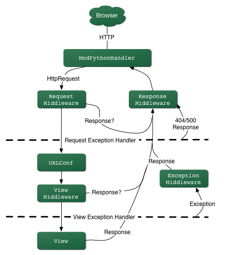

# 3 Hello World app

- Objetivo: Crear la típica aplicación "Hello World"

## 3.1 Configuración inicial

```
$ cd ~/Escritorio
$ mkdir helloworld
$ cd helloworld
$ pipenv install django
$ pipenv shell
(helloworld) $ django-admin startproject helloworld_project .
(helloworld) $ sudo apt install tree
(helloworld) $ tree
.
├── Pipfile
├── Pipfile.lock
├── manage.py
└── helloworld_project
    ├── asgi.py
    ├── __init__.py
    ├── settings.py
    ├── urls.py
    └── wsgi.py

1 directory, 8 files
```

- `settings.py`: Controla la configuración del proyecto
- `urls.py`: Indica a Django qué páginas construir en respuesta a una petición de URL
- `wsgi.py`: (*Web Server Gateway Interface*) Punto de entrada para servidores web compatibles con WSGI para servir el proyecto. Este archivo solo se usa en la fase de despliegue.
- `asgi.py`: (*Asynchronous Server Gateway Interface*) Punto de entrada para servidores web compatibles con ASGI para servir el proyecto (nuevo en la versión 3.0). Este archivo solo se usa en la fase de despliegue.
- `manage.py`: Ejecuta varios comandos Django, como correr el servidor web local o crear una nueva **app**

```bash
(helloworld) $ python manage.py runserver
```

 Visitar: `http://localhost:8000`

## 3.2 Crear una **app**

- Un **proyecto** Django consta de una o más **apps**
- Cada **app** resuelve una funcionalidad concreta
- Crear la **app** `pages`

```
(helloworld) $ python manage.py startapp pages
(helloworld) $ tree
...
└── pages
    ├── __init__.py
    ├── admin.py
    ├── apps.py
    ├── migrations
    │   └── __init__.py
    ├── models.py
    ├── tests.py
    └── views.py
```

- Nuevos FICHEROS 
  - `admin.py`: Es un fichero de configuración para la **app** incorporada al Admin de Django
  - `apps.py`: Es una fichero de configuración para la propia **app**
  - `migrations/`: Manteniene el seguimiento de cualquier cambio en el fichero `models.py` para que la *base de datos* y el fichero `models.py` estén sincronizados
  - `models.py`: Es donde se define el modelo de la base de datos que Django traduce en tablas dentro de la base de datos automáticamente.
  - `tests.py`: Es para los tests específicos de la **app**
  - `views.py`: Es donde se gestiona la lógica petición/respuesta *(request/response)* de la **app**
- Aunque la **app** existe, Django no sabe nada de ella hasta que se la añadimos explícitamente.
- Para incluir la app en el proyecto se necesita añadir una **referencia a su clase de configuración** en la lista [`INSTALLED_APPS`](https://docs.djangoproject.com/en/3.0/ref/settings/#std:setting-INSTALLED_APPS). La clase `PagesConfig` está en el archivo `pages/apps.py` , por eso su *path* con puntos es `'pages.apps.PagesConfig'`.

> DETALLE
> Tener en cuenta que dentro de cada aplicación, Django crea un archivo, `apps.py`, que contiene una clase de configuración con el nombre de la aplicación. En este caso, la clase se llama `PagesConfig`. Para registrar nuestra aplicación con Django, se necesita apuntar a la clase `PagesConfig`.
> `PagesConfig` por defecto contiene una única opción de configuración: el nombre de la aplicación, en nuestro caso `pages`.

 FICHERO: `settings.py` 

```
...
    # helloworld_project/settings.py
    INSTALLED_APPS = [
        'pages.apps.PagesConfig', # new
        'django.contrib.admin',
        'django.contrib.auth',
        'django.contrib.contenttypes',
        'django.contrib.sessions',
        'django.contrib.messages',
        'django.contrib.staticfiles',
    ]
...
```

- *Ojo, el **orden** importa; si varias aplicaciones intentan acceder al mismo recurso, la **app** que aparece primero tiene preferencia.*

> DETALLE: `settings.py`
> El fichero **settings.py** se usa para configurar muchos otros ajustes, pero en este punto probablemente sólo se querrá cambiar la [TIME_ZONE](https://docs.djangoproject.com/en/3.0/ref/settings/#std:setting-TIME_ZONE) — ésta debería ser igual a una cadena de la [Lista de base de datos tz de time zones](https://en.wikipedia.org/wiki/List_of_tz_database_time_zones) (la columna *TZ column* de la tabla contiene los valores que se necesitan). Cambiar la `TIME_ZONE` al valor de entre estas cadenas que sea apropiado para el uso horario que se requiera, por ejemplo:
> 
> ```
> TIME_ZONE = 'Europe/Madrid'
> ```
> 
> Hay otros dos ajustes que no se cambiarán ahora, pero de los que se debería ser consciente:
> 
> - `SECRET_KEY`. Ésta es una clave secreta que se usa como parte de la estrategia de seguridad del sitio web de Django. Si no se va a proteger este código durante el desarrollo, se necesitará usar un código diferente (quizás leyendo de una variable de entorno o un fichero)  cuando se ponga en producción. 
> - `DEBUG`. Esto habilita que los registros (logs) de  depuración se muestren en caso de error, en vez de las respuestas con los códigos de estado HTTP. Éste debería ajustarse a `false` en producción, ya que la información de depuración es útil a los atacantes. 
> 
> En la configuración de `INSTALLED_APPS`, en la parte superior del archivo, se encuentran los nombres de todas las aplicaciones que se activan en esta instancia de Django. Las aplicaciones pueden utilizarse en varios proyectos, y se pueden empaquetar y distribuir para que otros las utilicen en sus propios proyectos. De forma predeterminada, `INSTALLED_APPS` contiene las siguientes aplicaciones, todas ellas incluidas en Django:
> 
> `django.contrib.admin` : El sitio de administración.
> `django.contrib.auth` : Un sistema de autenticación.
> `django.contrib.contenttypes` : Un marco de trabajo para los tipos de contenido.
> `django.contrib.sessions` : Un marco de trabajo de sesiones.
> `django.contrib.messages` : Un marco de mensajes.
> `django.contrib.staticfiles`: Un marco de trabajo para la gestión de archivos estáticos.
> 
> Estas aplicaciones se incluyen de forma predeterminada como una conveniencia para el caso común. Sin embargo, algunas de estas aplicaciones utilizan al menos una tabla de la base de datos, por lo que se necesitan crear las tablas de la base de datos antes de poder utilizarlas. Para ello, hemos de hacer una **migración** con el siguiente comando:
> 
> ```
> python manage.py migrate
> ```
> 
> El comando de migración mira la configuración de `INSTALLED_APPS` y crea las tablas de base de datos necesarias de acuerdo con la configuración de la base de datos del archivo `settings.py` y las migraciones de bases de datos enviadas con cada aplicación. Se cubrirá más adelante.

## 3.3 Vistas (Views) y configurariones de URL's (URLConfs)

- En *Django*, las vistas determinan qué contenido se muestra mientras que *URLConfs* indica dónde va ese contendio.

- URLConf utiliza una expresión regular para mapear las peticiones a la función apropiada de la vista que devuelve los datos correctos. 
  
  - La vista saca el texto `Hello, World` mientras que la url se asegurará de que cuando el usuario visita la página sea redireccionado a la vista correcta.
  
  - Cuando se escribe una URL, lo primero que ocurre dentro del proyecto *Django* es que se encuentra un patrón que coincide con la página de inicio (*homepage*). El `urlpattern` especifica una **vista**, que determinará el contenido de la página (normalmente desde una base de datos), y una **plantilla** (*template*) para darle estilo. El resultado final se devuelve al usuario como una respuesta HTTP.
    
    <div class=text-center>
    URL -> View -> Model (típicamente) -> Template 
    </div>

> DETALLE:
> Una URLconf es como una tabla de contenido para un sitio web hecho con Django. Básicamente, es un mapeo entre los patrones URL y las funciones de vista que deben ser llamadas por esos patrones URL. Es como decirle a Django, "Para esta URL, llama a este código, y para esta URL, llama a este otro código". Recordar que estas funciones de vista deben estar en el Python path. 

- Se empieza actualizando el fichero `views.py`
  
  FICHERO: `pages/views.py` 

```
    # from django.shortcuts import render
    from django.http import HttpResponse     # new


    # Create your views here.
    def homePageView(request):               # new
        return HttpResponse("Hello World!")  # new
```

- Básicamente se indica que siempre que se llame a la función de la vista `homePageView` se devolverá el texto `“Hello World!”` . 
  - Más específicamente se ha importado el método `HttpResponse` para poder devolver un objeto respuesta al usuario.

> DETALLE
> 
> - Primero, se importa la clase `HttpResponse`, que vive en el módulo `django.http`. Se necesita importar esta clase porque se usa más tarde en el código.
> 
> - A continuación, se define una función llamada `homePageView`- la función de la vista.
>   
>   Cada función `view` toma al menos un parámetro, llamado `request` por convención. Se trata de un objeto que contiene información sobre la solicitud web actual que ha activado esta vista, y es una instancia de la clase `django.http.HttpRequest`.
>   En este ejemplo, no se hace nada con la solicitud , pero debe ser el primer parámetro de la vista de todos modos. Téngase en cuenta que el nombre de la función de la vista no importa; no tiene que estar nombrada de una forma determinada para que Django la reconozca. Se le llama `homePageView` aquí, porque ese nombre indica claramente lo esencial de la vista, pero también podría llamarse `hola_mundo_maravilloso_y_hermoso`, o algo igualmente repugnante. En breve, se iluminará el camino de cómo Django encuentra esta función.  La función es una línea que devuelve un objeto `HttpResponse` instanciado con el texto `Hello, world!`.
>   La principal lección aquí es ésta: **una vista es sólo una función Python que toma una `HttpRequest` como primer parámetro y devuelve una instancia de `HttpResponse`**. Para que una función Python sea una vista Django, debe hacer estas dos cosas. (Hay excepciones, pero se verán más tarde).

- Ahora a configurar *urls*. Crear un nuevo archivo `urls.py` dentro del directorio `pages`.

```bash
(helloworld) $ touch pages/urls.py
```

- Añadir el código
  
  FICHERO: `pages/urls.py` 

```python
# pages/urls.py
from django.urls import path
from .views import homePageView

urlpatterns = [
    path('', homePageView, name='home')
]
```

- Importamos `path`

- `.views` utiliza "." para indicar el directorio actual

- El patrón `urlpattern` tiene tres partes:
  
  - Una expresión regular Python para la cadena vacía ''
  - Especifica la vista que se llamará: `homePageView`
  - Añade un nombre de URL opcional `home`

- Es decir, si el usuario requiere la pagina de inicio, representada por la cadena vacía, entonces utilizar la vista llamada `homePageView`

- El último paso es configurar el fichero `urls.py` a nivel de proyecto donde se recogen todas las **apps** dentro de un proyecto Django, dado que **cada una precisa de su propia ruta**.
  
  > DETALLE
  > Notemos que se pasa la función de vista `homePageView` como un objeto sin llamar a la función. Esto es una característica de Python (y otros lenguajes dinámicos): las funciones son objetos de primera clase, lo cual significa que se puede pasar como cualquier otra variable. ¡Qué bueno!, ¿no?
  
  FICHERO: `helloworld_project/urls.py` 

```python
from django.contrib import admin
from django.urls import path, include # new

urlpatterns = [
    path('admin/', admin.site.urls),
    path('', include('pages.urls')),  # new
]
```

- Puede confundir un poco que no se necesite importar la app `pages` pero ya se hace referencia en `urlpatterns` como `pages.urls`.
  - La razón de hacerlo así es que el método `django.urls.include()` ya recibe un módulo, o **app**, como primer argumento. Así que, sin usar `include`, habría que importar la **app** `pages` pero, como sí que se usa, no se necesita a nivel de proyecto.

> DETALLE: **URLconfs y el acoplamiento débil**
> 
> Ahora es el momento de resaltar una parte clave de la filosofía detrás de las URLconf y detrás de Django en general: el **principio de acoplamiento débil** (loose coupling). Para explicarlo de forma simple, el acoplamiento débil es una manera de diseñar software aprovechando el valor de la importancia de que se puedan cambiar las piezas. Si dos piezas de código están débilmente acopladas (loosely coupled) los cambios realizados sobre una de dichas piezas va a tener poco o ningún efecto sobre la otra.
> 
> Las URLconfs de Django son un claro ejemplo de este principio en la práctica. En una aplicación Web de Django, la definición de la URL y la función de vista que se llamará están débilmente acopladas; de esta manera, la decisión de cuál debe ser la URL para una función, y la implementación de la función misma, residen en dos lugares separados. Esto permite el desarrollo de una pieza sin afectar a la otra.
> 
> En contraste, otras plataformas de desarrollo Web acoplan la URL con el programa. En las típicas aplicaciones PHP, por ejemplo, la URL de la aplicación es designada por dónde se coloca el código en el sistema de archivos. En versiones anteriores del framework Web Python [CherryPy](http://www.cherrypy.org/) la URL de la aplicación correspondía al nombre del método donde residía tu código. Esto puede parecer un atajo convenient a corto plazo, pero puede tornarse inmanejable a largo plazo.
> 
> Por ejemplo, consideremos una función de vista que nos muestra la fecha y la hora actual. Si se quiere cambiar la URL de la aplicación — digamos, mover desde algo como `/time` a `/currenttime/` — se puede hacer un rápido cambio en la URLconf, sin tener que preocuparse acerca de la implementación subyacente de la función. Similarmente, si se quiere cambiar la función de la vista — alterando la lógica de alguna manera — se puede hacer sin afectar la URL a la que está asociada la función de vista. Además, si se quiere exponer la funcionalidad de fecha actual en varias URL se podría hacer editando el URLconf con cuidado, sin tener que tocar una sola línea de código de la vista.
> Eso es el acoplamiento débil en acción: una **filosofía de desarrollo**.

## 3.4 Resumen

### 1.- CREAR APP

```bash
(helloworld) $ python manage.py startapp pages
```

### 2.- INFORMAR DE LA NUEVA APP

 FICHERO: `settings.py` 

```python
...
INSTALLED_APPS = [
...
    'pages.apps.PagesConfig',
```

### 3.- CREAR LA VISTA

 FICHERO: `pages/views.py` 

```python
# from django.shortcuts import render
from django.http import HttpResponse


# Create your views here.
def homePageView(request):
    return HttpResponse("Hello World!")
```

### 4.- CREAR EL FICHERO DE RUTAS DE LA APP

 FICHERO: `pages/urls.py` 

```python
# pages/urls.py
from django.urls import path
from .views import homePageView

urlpatterns = [
    path('', homePageView, name='home')
]
```

### 5.- INCLUIR EL FICHERO DE RUTAS DE LA APP EN EL PRINCIPAL

 FICHERO: `helloworld_project/urls.py` 

```python
from django.contrib import admin
from django.urls import path, include

urlpatterns = [
    path('admin/', admin.site.urls),
    path('', include('pages.urls')),
]
```

## 3.5. Cómo procesa una petición Django

- Se deben señalar varias cosas en lo que hemos visto. Este es el detalle de lo que sucede cuando se ejecuta el servidor de desarrollo de Django y se hace una petición a una página Web.
  
  - El comando python `manage.py runserver` importa un archivo llamado `settings.py` desde el mismo directorio. Este archivo contiene todo tipo de configuraciones opcionales para esa instancia de Django en particular, pero una de las configuraciones más importantes es `ROOT_URLCONF`. La variable `ROOT_URLCONF` le dice a Django qué módulo de Python debería usar para la URLconf de este sitio Web.  `settings.py` que es generado automáticamente tiene un `ROOT_URLCONF` que apunta al `urls.py` generado automáticamente.
  - Cuando llega una petición Django carga la URLconf apuntada por la variable `ROOT_URLCONF`. Luego comprueba cada uno de los patrones de URL en la URLconf en orden, comparando la URL solicitada con un patrón a la vez, hasta que encuentra uno que coincida. Cuando lo encuentra, llama a la función de vista asociada con ese patrón, pasando un objeto `HttpRequest` como primer parámetro de la función.
  - La función de vista es responsable de retornar un objeto `HttpResponse`.

- Una vez se conoce lo básico sobre cómo hacer páginas Web con Django. Es muy sencillo, realmente sólo hay que escribir funciones de vista y relacionarlas con URLs mediante URLconfs. Se podría pensar que es lento enlazar URL's con funciones.

### 3.3.1. Cómo procesa una petición Django: Detalles completos

- Además del mapeo directo de URLs con funciones vista que acabamos de describir, Django nos provee un poco más de flexibilidad en el procesamiento de peticiones.

- El flujo típico — resolución de URLconf a una función de vista que retorna un HttpResponse — puede ser cortocircuitado o aumentado mediante middleware. Los secretos del middleware serán tratados en profundidad más adelante, pero un esquema ayudará conceptualmente a poner todas las piezas juntas.



- Cuando llega una petición HTTP desde el navegador, un manejador específico a cada servidor construye la `HttpRequest`, para pasarla a los componentes y maneja el flujo del procesamiento de la respuesta.

- El manejador luego llama a cualquier middleware de Petición o Vista disponible. Estos tipos de middleware son útiles para augmenting los objetos HttpRequest así como también para proveer manejo especial a determinados tipos de peticiones. En el caso de que alguno de los mismos retornara un HttpResponse la vista no es invocada.

- Hasta a los mejores programadores se le escapan errores (bugs), pero el middleware de excepción ayuda a aplastarlos. Si una función de vista lanza una excepción, el control pasa al middleware de Excepción. Si este middleware no retorna un `HttpResponse`, la excepción se vuelve a lanzar.

- Sin embargo, no todo está perdido. Django incluye vistas por omisión para respuestas amigables a errores 404 y 500.

- Finalmente, el middleware de respuesta es bueno para el procesamiento posterior a un `HttpResponse` justo antes de que se envíe al navegador o haciendo una limpieza de recursos específicos a una petición.
