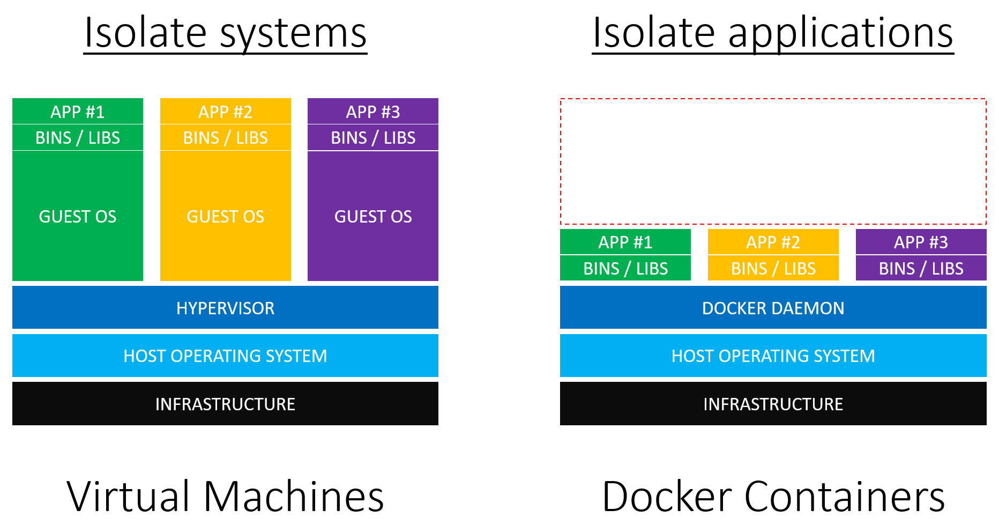
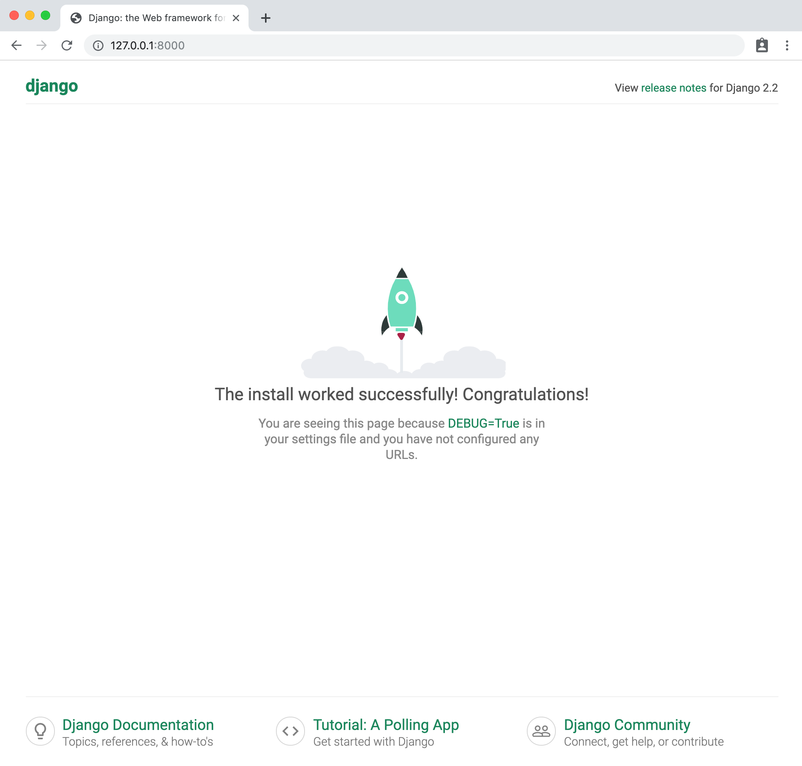
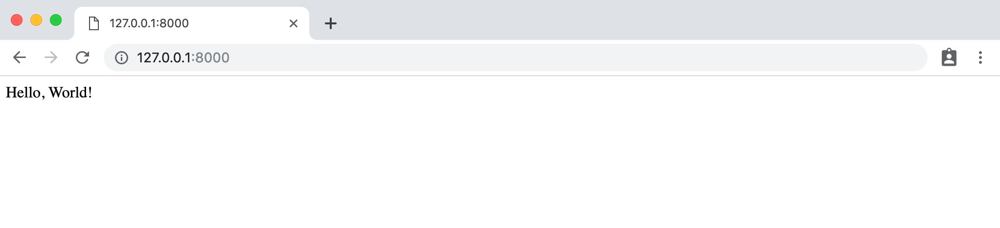

# 18. Docker
---
- La configuración adecuada de un entorno de desarrollo local sigue siendo un gran reto a pesar de todos los otros avances de la programación moderna. Simplemente hay demasiadas variables: **diferentes ordenadores**, **sistemas operativos**, **versiones de lenguajes** y **frameworks**, **opciones de entornos virtuales**,  y así sucesivamente. Cuando se añade el reto de **trabajar en equipo** en un entorno en el que todos necesitan tener la misma configuración, el problema se magnifica.

- En los últimos años ha surgido una solución: [Docker](https://www.docker.com/). Aunque sólo tiene unos pocos años, Docker se ha convertido rápidamente en la opción por defecto para muchos desarrolladores que trabajan en proyectos a nivel de producción.

- Con Docker finalmente es posible reproducir un entorno de producción de forma fiel y fiable localmente, desde la versión adecuada de Python hasta la instalación de Django a la par de ejecutar servicios adicionales como una base de datos a nivel de producción. Esto significa que ya no es importante si se desarrolla en un equipo Linux, Mac o Windows. Todo funciona dentro del mismo Docker.

- Docker también facilita exponencialmente la colaboración en equipo. Atrás quedaron los días de compartir archivos `README` largos y obsoletos para añadir un nuevo desarrollador a un proyecto de grupo.

- En lugar de eso, con Docker sólo se tienen que compartir dos archivos: `Dockerfile` y  `docker-compose.yml` y el desarrollador puede tener la confianza de que su **entorno de desarrollo local es exactamente igual que el del resto del equipo**.

- Docker no es una tecnología perfecta. Todavía es relativamente nueva y compleja bajo el capó; aún está en desarrollo activo. Pero aspira a la promesa de una política coherente y a un entorno de desarrollo compartible, que pueda ejecutarse localmente en cualquier ordenador o desplegado en cualquier servidor, lo que lo convierte en una opción sólida.

## 18.1. ¿Qué es Docker?
- Docker es una forma de aislar todo un sistema operativo a través de **contenedores Linux** que son un tipo de virtualización. La virtualización tiene sus raíces en los inicios de la informática cuando las computadoras grandes y caras eran la norma. ¿Cómo podrían varios programadores utilizar la misma máquina?. La respuesta fue la virtualización y específicamente las máquinas virtuales que son copias completas de un sistema informático desde el sistema operativo en adelante.

- Cuando se alquila un espacio en un proveedor de cloud computing como Amazon Web Services (AWS) normalmente no se proporciona una pieza de hardware dedicada. En lugar de eso, se comparte un servidor físico con otros clientes. Pero como cada cliente tiene su propio sistema virtual que se ejecuta en el servidor, le parece que tiene el suyo propio.

- Esta tecnología es la que hace posible añadir o eliminar servidores de un *servicio de cloud* de forma rápida y sencilla. Se trata en gran medida de software entre bastidores, no de hardware real.

- ¿Cuál es el inconveniente de una máquina virtual? Tamaño y velocidad. Un sistema operativo huésped típico (*guest*) puede ocupar fácilmente hasta 700MB de tamaño. Así que si un servidor físico soporta tres máquinas virtuales, eso es al menos 2,1 GB de espacio en disco ocupado junto con el resto de necesidades para otros recursos como CPU y memoria.

- Al entrar en Docker, la idea clave es que la mayoría de los ordenadores dependen del mismo sistema operativo [Linux](https://es.wikipedia.org/wiki/GNU/Linux). ¿Y si virtualizamos desde la capa de Linux hacia arriba? ¿No proporcionaría eso una forma más rápida y ligera de duplicar gran parte de la misma funcionalidad? La respuesta es sí. Y en los últimos años los contenedores [Linux](https://en.wikipedia.org/wiki/List_of_Linux_containers) se han vuelto muy populares. Para la mayoría de las aplicaciones -especialmente las aplicaciones web- una máquina virtual proporciona mucho más recursos de los que se necesitan y un contenedor es más que suficiente.

- Esto, fundamentalmente, es Docker: ¡una forma de implementar contenedores Linux!

- Una analogía que podemos usar es la de los edificios y los apartamentos. Las máquinas virtuales son como viviendas: edificios independientes con su propia infraestructura, incluida la fontanería y calefacción, así como cocina, baños, dormitorios, etc. Los contenedores Docker son como los apartamentos: comparten una infraestructura común como la fontanería y la calefacción, pero vienen en varios tamaños que se ajustan a las necesidades exactas de un propietario.

## 18.2. Contenedores vs. Entornos Virtuales

- Como programador de Python se debe estar familiarizado con el concepto de **entornos virtuales** que son una forma de aislar los paquetes Python. Gracias al entorno virtual, una computadora puede ejecutar múltiples proyectos localmente. Por ejemplo, el Proyecto A podría usar Python 3.4 y Django 1.11 entre otras dependencias; mientras que el Proyecto B usa Python 3.8 y Django 2.2. Configurando un entorno virtual dedicado en cada proyecto se puede gestionar estos diferentes paquetes de software sin contaminar nuestro entorno global.

- Hay una pequeña confusión derivada de que hay múltiples herramientas en este momento para implementar un entorno virtual: desde `virtualenv`, `venv` a `Pipenv`, pero fundamentalmente todas hacen lo mismo.

- La mayor distinción entre los entornos virtuales y Docker es que los entornos virtuales sólo pueden aislar paquetes Python. **No pueden aislar a los no-Python como una base de datos** PostgreSQL o MySQL. Y siguen dependiendo del sistema global; de la instalación de Python a nivel de sistema (en otras palabras, de **su** ordenador). **Los entornos virtuales apuntan a una instalación Python existente; no contienen Python en sí mismos**.

- Los contenedores Linux van un paso más allá y **aíslan todo el sistema operativo**, no sólo las partes de Python. En otras palabras, instalaremos el propio Python dentro de Docker, así como se instalará y ejecutará en él la base de datos a nivel de producción.

- Docker en sí mismo es un tema complejo y no se va a profundizar tanto en él, sin embargo, es importante comprender sus antecedentes y componentes clave. Si quieres aprender más sobre él puedes acceder a diferentes cursos de los que dispones en la plataforma de [OpenWebinars](https://www.openwebinars.com).

## 18.3. Instalar Docker

- Ok, suficiente teoría. Empecemos a usar Docker y Django juntos. El primer paso es registrarse en [Docker Hub](https://hub.docker.com/signup) para obtener una cuenta gratuita y luego instalar la aplicación de escritorio Docker en nuestra máquina local:

    - [Docker para Linux](https://docs.docker.com/install/)
        - Para distribuciones basadas en [Arch](https://wiki.archlinux.org/index.php/Docker) será algo tan fácil como ejecutar `pacman -S docker`
    - [Docker para Mac](https://hub.docker.com/editions/community/docker-ce-desktop-mac)
    - [Docker para Windows]( https://hub.docker.com/editions/community/docker-ce-desktop-windows)

- Esta descarga puede tomarse algún tiempo ya que es un archivo grande.

- Una vez que Docker se haya terminado de instalar, podemos confirmar que se está ejecutando la versión correcta escribiendo `docker --version` en la línea de comandos. Debe ser al menos la versión 18.

```bash
$ docker --version
Docker versión 19.03.5-ce, build 633a0ea838
```

- Docker se utiliza a menudo con una herramienta adicional, [Docker Compose](https://docs.docker.com/compose/), para ayudar a automatizar los comandos. Docker Compose se incluye con las descargas de Mac y Windows, pero si se está en Linux, tendrá que añadirse manualmente. Puede hacerse ejecutando el comando `sudo pip install docker-compose` después de que la instalación de Docker haya finalizado.

    - Para distribuciones basadas en [Arch](https://wiki.archlinux.org/index.php/Docker) será algo tan fácil como ejecutar `pacman -S docker-compose`. (Si surgen problemas con algún fichero ya instalado en el sistema, borrar todos aquellos ficheros que estén involucrados y proceder con la instalación como se indica)

## 18.4. Docker, Hola Mundo

- Docker se envía con su propia imagen de "Hello, World" que es un primer paso útil para comprobar la instalación. Introducir en la línea de comandos el comando `docker run hello-world`. Esto descargará una imagen Docker oficial y luego se ejecutará dentro de un contenedor. Se discutirá sobre las imágenes y los contenedores en breve.

```bash
$ docker run hello-world
Unable to find image 'hello-world:latest' locally
latest: Pulling from library/hello-world
1b930d010525: Pull complete
Digest: sha256:b8ba256769a0ac28dd126d584e0a2011cd2877f3f76e093a7ae560f2a5301c00
Status: Downloaded newer image for hello-world:latest
Hello from Docker!
This message shows that your installation appears to be working correctly.
To generate this message, Docker took the following steps:
 1. The Docker client contacted the Docker daemon.
 2. The Docker daemon pulled the "hello-world" image from the Docker Hub.
(amd64)
 3. The Docker daemon created a new container from that image which runs the executable that produces the output you are currently reading.
 4. The Docker daemon streamed that output to the Docker client, which sent it to your terminal.
To try something more ambitious, you can run an Ubuntu container with:
$ docker run -it ubuntu bash
Share images, automate workflows, and more with a free Docker ID:
https://hub.docker.com/
For more examples and ideas, visit:
https://docs.docker.com/get-started/
```

- El comando `docker info` nos permite inspeccionar Docker. Contendrá una gran cantidad de información, pero si nos centramos en las líneas superiores tenemos 1 contenedor que se detenido y 1 imagen.

```bash
$ docker info
Client:
 Debug Mode: false
 
Server:
 Containers: 1
  Running: 0
  Paused: 0
  Stopped: 1
 Images: 1
...
```

## 18.5. Django, Hola mundo

- Ahora vamos a crear un proyecto de Django "Hello, World" que se ejecuta localmente en nuestro ordenador y luego lo moveremos por completo dentro de Docker para que se pueda ver cómo encajan todas las piezas.

- El primer paso es elegir una ubicación para nuestro código. Esto puede ser en cualquier parte del ordenador pero si se está en Linux, una ubicación fácil de encontrar es el Escritorio . Desde la línea de comandos navegamos hasta el `Escritorio` y creamos un directorio `code` para todos los ejemplos:

```bash
$ cd ~/Desktop
$ mkdir code && cd code
```

- Luego creeamos un directorio `hello` donde  instalaremos Django usando Pipenv que crea un archivo Pipfile y un archivo Pipfile.lock.  Activamos el entorno virtual con
  el comando `shell`.

```bash
$ mkdir hello && cd hello
pipenv install django==2.2.7
$ pipenv shell
(hello) $
```

- Si se necesita ayuda para instalar Pipenv o Python 3, se pueden encontrar más detalles [aquí]( https://djangoforbeginners.com/initial-setup/).
  Ahora podemos usar el comando `startproject` para crear un nuevo proyecto de Django llamado `hello_project`. Añadir un punto, `.`, al final del comando es un paso opcional pero muchos desarrolladores de Django lo hacen. Sin el punto, Django añade un directorio adicional al proyecto; con el `. `, esto no ocurre.
- Por último, utilice el comando `migrate` para inicializar la base de datos e iniciar la web local con el comando `runserver`.

```bash
(hola) $ django-admin startproject hello_project .
(hola) $ python manage.py migrate
(hola) $ python manage.py runserver
```
- Suponiendo que todo ha funcionado correctamente, ahora deberíamos poder navegar para ver el la págica de bienvenida de Django en [http://127.0.0.1:8000/](http://127.0.0.1:8000/) en su navegador web.



## 18.6. Pages App

- Ahora haremos una página de inicio simple creando una `pages` **app** específica  para ello. Parar el servidor local escribiendo *Control+c* y luego usar el comando `startapp` añadiendo el nombre de la `pages` que se desee.

```bash
(hola) $ python manage.py startapp pages
```

- Django instala automáticamente un nuevo directorio de páginas y varios archivos para nosotros. Pero incluso aunque la app ha sido creada, nuestro `hello_project` no la reconocerá hasta que la añadamos a la configuración de `INSTALLED_APPS` de archivo `hello_project/settings.py`.

- Django carga las apps de arriba a abajo, por lo que, en general, es una buena práctica añadir las nuevas aplicaciones debajo de las aplicaciones incorporadas en las que pueden confiar, tales como `admin`, `auth`, y todas las aplicaciones restantes.

- Téngase en cuenta que si bien es posible simplemente escribir el nombre de la app, `pages`,  es mejor escribir la `pages.apps.apps.PagesConfig` completa lo que abre más posibilidades en la configuración de las apps.

```python
# hello_project/settings.py
INSTALLED_APPS = [
    'django.contrib.admin',
    'django.contrib.auth',
    'django.contrib.contenttypes',
    'django.contrib.sessions',
    'django.contrib.messages',
    'django.contrib.staticfiles',
    'pages.apps.apps.PagesConfig', # nuevo
]
```

- Ahora podemos establecer la ruta URL para la app `pages`. Ya que queremos que nuestro mensaje aparezca en la página de inicio usaremos la cadena vacía `''` . No olvidar añadir la importación de `include` en la segunda línea también.

```python
# hello_project/urls.py
from django.contrib import admin
from django.urls import path, include # nuevo

urlpatterns = [
    path('admin/', admin.site.urls),
    path('', include('pages.urls')), # nuevo
]
```

- En lugar de crear una plantilla en este punto, podemos simplemente codificar un mensaje en nuestra capa de la vista `pages/views.py` que producirá la cadena `Hello, World!`.

```python
# pages/views.py
from django.http import HttpResponse

def home_page_view(request):
    return HttpResponse('Hello, World!')
```

- ¿Qué es lo siguiente? El último paso es crear un archivo `urls.py` dentro de la app `pages`y enlazarlo to `home_page_view`. Si se encuentra en un ordenador Mac o Linux, el comando `touch` se puede usar desde la línea de comandos para crear nuevos archivos. En Windows habrá que crear el nuevo archivo con un editor de texto.

```bash
(hola) $ touch pages/urls.py
```

- En el editor de texto importar `path` en la primera línea, añadir la `home_page_view`, y colocar su ruta para otra vez ser la cadena vacía ''. Nótese que también provee un nombre opcional, `home`, para esta ruta lo cual es una buena práctica.

```python
# pages/urls.py
from django.urls import path

from .views import home_page_view


urlpatterns = [
path('', home_page_view, name='home')
]

```
- El flujo completo de nuestra página web Django es el siguiente:

    - cuando un usuario va a su *homepage* será primero encaminado a `hello_project/urls.py`
    - luego a `pages/urls.py`
    - y finalmente dirigido a la `home_page_view` que devuelve la cadena `Hello, World!`

- El trabajo para una página de inicio básica ha terminado. Iniciemos de nuevo el servidor local.

```bash
(hola) $ python manage.py runserver
```

- Si se actualiza el navegador web en http://127.0.0.1:8000/, ahora saldrá nuestro deseado mensaje.



- Ahora es el momento de cambiar a Docker. Detengamos de nuevo el servidor local con *Ctrl+C* y salgamos de nuestro entorno virtual, que ya no necesitamos, escribiendo `exit`.

```bash
(hello) $ exit
$
```

- ¿Cómo sabemos que nuestro entorno virtual ya no está activo? No habrá un paréntesis alrededor del nombre de directorio en el prompt. Cualquier comando Django normal que se intente ejecutar en este punto fallará. Por ejemplo, probar `python manage.py runserver` para ver lo que ocurre.

```bash
$ python manage.py runserver
File "./manage.py", line 14
  ) from exc
       ^
SyntaxError: invalid syntax
```

- Esto significa que estamos totalmente fuera del entorno virtual y preparados para Docker.

## 18.7. Imágenes, Contenedores y el "Docker Host"

- Una **imagen** Docker es una instantánea en el tiempo de lo que contiene un proyecto. Está representado por un `Dockerfile` y es literalmente una lista de instrucciones que deben ser construidas/ejecutadas. Un **contenedor** Docker es una instancia en ejecución de una imagen. Para continuar con la analogía de nuestro apartamento de antes, la imagen es el plano o conjunto de planos del apartamento; el contenedor es el edificio real totalmente construido.

- El tercer concepto central es el **Docker host**, que es el sistema operativo subyacente. Es posible tener varios contenedores ejecutándose dentro de un mismo **Docker host**. Cuando nos referimos a código o procesos que se ejecutan en el Docker, significa que se ejecutan en el **Docker host**.

- Creemos nuestro primer `Dockerfile` para ver toda esta teoría en acción.

```bash
$ touch Dockerfile
```

- Dentro del `Dockerfile` agregamos el siguiente código que recorreremos línea por línea más abajo.

```Dockerfile
# Pull base image
FROM python:3.8


# Set environment variables
ENV PYTHONDONTWRITEBYTECODE 1
ENV PYTHONUNBUFFERED 1


# Set work directory
WORKDIR /code


# Install dependencies
COPY Pipfile Pipfile.lock /code/
RUN pip install pipenv && pipenv install --system


# Copy project
COPY . /code/
```

- Los `Dockerfiles` se leen de arriba hacia abajo cuando se crea una imagen. La primera instrucción debe ser el comando `FROM` que nos permite importar una **imagen base** que usar, en nuestro caso *Python 3.8*.

- Luego usamos el comando `ENV` para establecer dos variables de entorno:

    - `PYTHONUNBUFFERED` asegura que la salida de nuestra consola se vea familiar y que no esté almacenada en un búfer de Docker, lo cual no queremos
    - `PYTHONDONTWRITEBYTECODE` significa que Python no intentará escribir archivos `.pyc`, que tampoco deseamos

- A continuación usamos `WORKDIR` para establecer una ruta de directorio de trabajo por defecto dentro de nuestra imagen llamada `code`que es donde guardaremos nuestro código. Si no lo hicimos, entonces cada vez que queramos ejecutar comandos dentro de nuestro contenedor tendríamos que escribir una ruta muy larga. En su lugar, Docker asumirá que queremos ejecutar todos los comandos desde este directorio.

- Para nuestras dependencias estamos usando `pipenv`, así que copiamos tanto el archivo `Pipfile` como el archivo `Pipfile.lock` en el directorio `/code/` en Docker.

- Vale la pena tomarse un momento para explicar por qué `pipenv` crea un `Pipfile.lock`. El concepto de bloqueo de archivos no es exclusivo de Python o Pipenv; de hecho ya está presente en los gestores de paquetes de los lenguajes de programación más modernos: `Gemfile.lock` en Ruby, `yarn.lock` en JavaScript, `composer.lock` en PHP, etc. Pipenv fue el primer proyecto popular en incorporarlos en la paquetería de Python.

- La ventaja de un archivo de bloqueo es que esto conduce a una construcción determinista: no importa cuántas veces se instalen los paquetes de software, se obtendrá el mismo resultado. Sin un fichero *lock* que "bloquee" las dependencias y su orden, no se cumpliría necesariamente. Lo que significa que dos miembros del equipo que instalan la misma lista de software pueden tener instalaciones de construcción ligeramente diferentes.

- Cuando estamos trabajando con Docker donde hay código tanto local en nuestro ordenador como también dentro de Docker, el potencial de conflictos de `Pipfile.lock` surge cuando se actualizan paquetes de software.

- Siguiendo adelante usamos el comando `RUN` para instalar primero `pipenv` y luego `pipenv install` para instalar los paquetes de software listados en nuestro Pipfile.lock, actualmente sólo Django. Es un es importante añadir también el indicador `--system`, ya que por defecto Pipenv buscará el parámetro en el que instalar cualquier paquete, pero como estamos dentro de Docker ahora, técnicamente no hay ningún entorno virtual. En cierto modo, el contenedor Docker es nuestro entorno virtual y mucho más. Así que debemos usar la bandera `--system` para asegurarnos de que nuestros paquestes están disponibles en todo el Docker para nosotros.

- Como paso final copiamos el resto de nuestro código local en el directorio `/code/` dentro de Docker. ¿Por qué copiamos el código local dos veces, primero el Pipfile y Pipfile.lock y luego el resto? La razón es que las imágenes se crean en base a instrucciones de arriba hacia abajo por lo que queremos que las cosas que cambian a menudo -como nuestro código local- sea el último. De esta manera sólo tenemos que regenerar esa parte de la imagen ante un cambio y no se reinstala todo cada vez que lo haya. Como el software de los paquetes contenidos en nuestros `Pipfile` y `Pipfile.lock` cambian con poca frecuencia, implica que no tiene sentido copiarlos e instalarlos antes.

- Nuestras instrucciones de imagen ya están hechas, así que vamos a construir la imagen usando el comando `docker build .`. El punto `.` indica que el directorio actual es donde se debe ejecutar el comando comando. Se genera una gran cantidad de texto en pantalla; sólo se incluye las dos primeras líneas y las tres últimas.

```bash
$ docker build .
Sending build context to Docker daemon 154.1kB
Step 1/7 : FROM python:3.8
...
Step 7/7 : COPY . /code/
---> a48b2acb1fcc
Successfully built a48b2acb1fcc
```

- Pasando a lo siguiente, ahora necesitamos crear un archivo `docker-composition.yml` para controlar cómo ejecutar el comando que será construido en base a nuestra imagen de `Dockerfile`.

```bash
$ touch docker-compose.yml
```

- Contendrá el siguiente código

```
version: '3.7'

services:
  web:
    build: .
    command: python /code/manage.py runserver 0.0.0.0:8000
    volumes:
      - .:/code
    ports:
      - 8000:8000
```

- En la línea superior se especifica la versión más reciente de Docker Compose que es actualmente 3.7  (no confundir con la versión de Python que puede ser bien parecida)
A continuación, especificamos qué `services` (o contenedores) queremos que funcionen en nuestro "Docker host". Es posible tener varios `services` funcionando, pero por ahora sólo tenemos uno para el servidor `web`. Especificaremos cómo construir el contenedor diciendo, "Busca el directorio en curso `.` el `Dockerfile`" . Luego, dentro del contenedor, ejecute el comando para arrancar el servidor local.
El montaje de los volúmenes sincroniza automáticamente el sistema de archivos Docker con nuestro sistema de archivos local. ¡Esto significa que no tenemos que reconstruir la imagen cada vez que cambiamos un solo fichero!.

- Por último especificamos los puertos (`ports`) a exponer dentro de Docker que solo será el 8000, que es el puerto Django por defecto.

- Si es la primera vez que utiliza Docker, es muy probable que se esté muy confundido en este momento. No hay motivo de preocupación. Crearemos múltiples imágenes y contenedores Docker y, con la práctica, el flujo comenzará a tener más sentido. Se verá como se usan archivos `Dockerfile` y `docker-composition.yml` muy similares en cada uno de los proyectos.

- El paso final es ejecutar nuestro contenedor Docker usando el comando `docker-compose up`. Este comando resultará en otro largo flujo de texto de salida en la línea de comandos.

```bash
$ docker-compose up
Creating network "hello_default" with the default driver
Building web
Step 1/7 : FROM python:3.8
...
Creating hello_web_1 ... done
Attaching to hello_web_1
web_1 | Performing system checks...
web_1 |
web_1 | System check identified no issues (0 silenced).
web_1 | September 20, 2019 - 17:21:57
web_1 | Django version 2.2.5, using settings 'hello_project.settings'
web_1 | Starting development server at http://0.0.0.0:8000/
web_1 | Quit the server with CONTROL-C.
```

- Para confirmar que realmente funcionó, volveremos a poner [http://127.0.0.1:8000/](http://127.0.0.1:8000/) en el navegador web. Actualizaremos la página y aparecerá la página "Hello, World".

- Django se está ejecutando ahora puramente dentro de un contenedor Docker. No estamos trabajando dentro de un entorno virtual local. No ejecutamos el comando `runserver`. Todo nuestro código y nuestro servidor Django se está ejecutando desde dentro de un Docker autónomo. !Todo un éxito!

- Detendremos el contenedor con *Ctrl+C* y además escribiremos `docker-compose down`. Los contenedores absorben una gran cantidad de memoria, así que es una buena idea detenerlos de esta manera cuando hayamos terminado de usarlos.

- Los contenedores se han concebido para ser estáticos (no pueden cambiar), por lo que utilizamos `volumes` para copiar nuestro código en sitios donde si que pueda guardarse.

```bash
$ docker-compose down
Removing hello_web_1 ... done
Removing network hello_default
```
