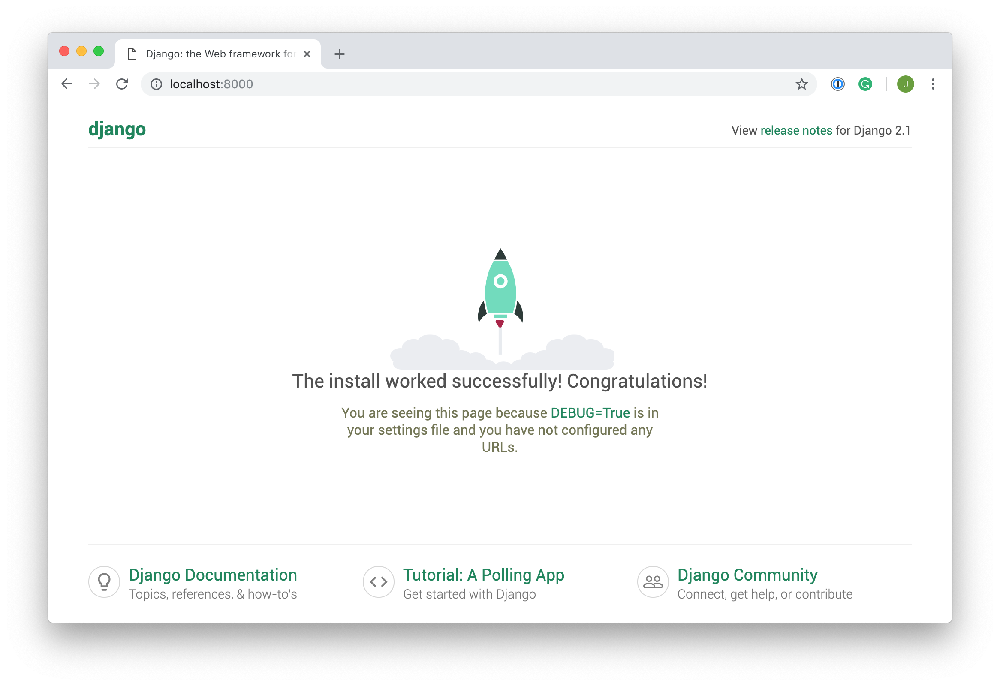
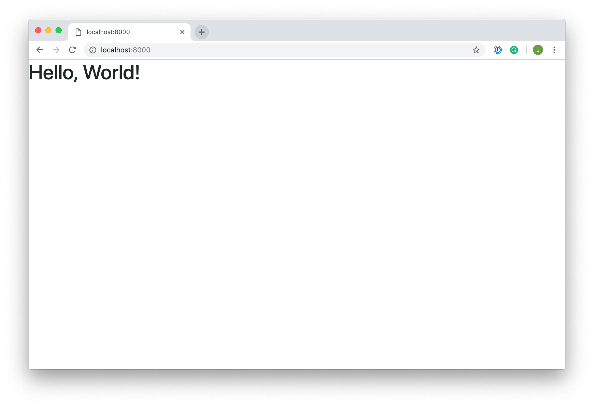
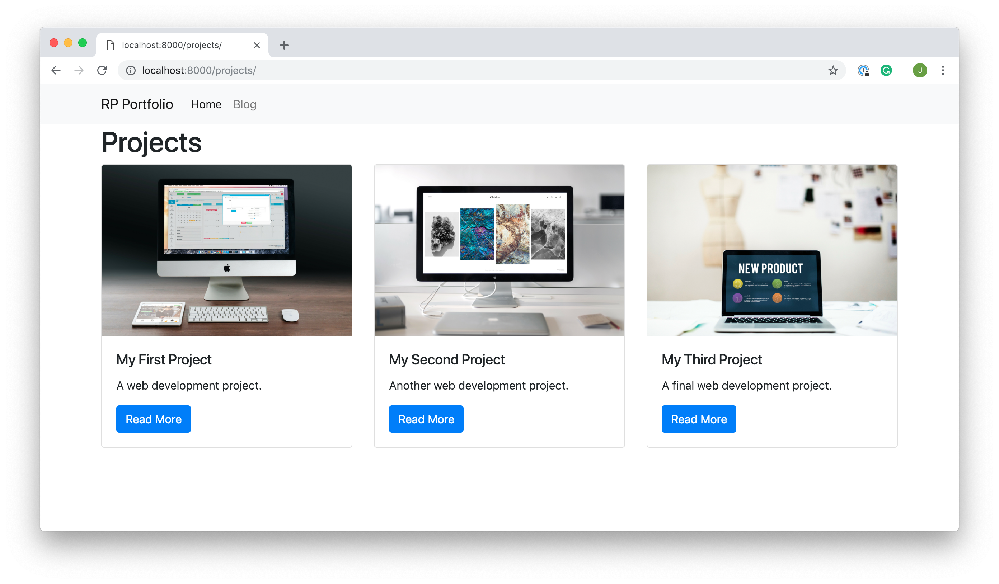
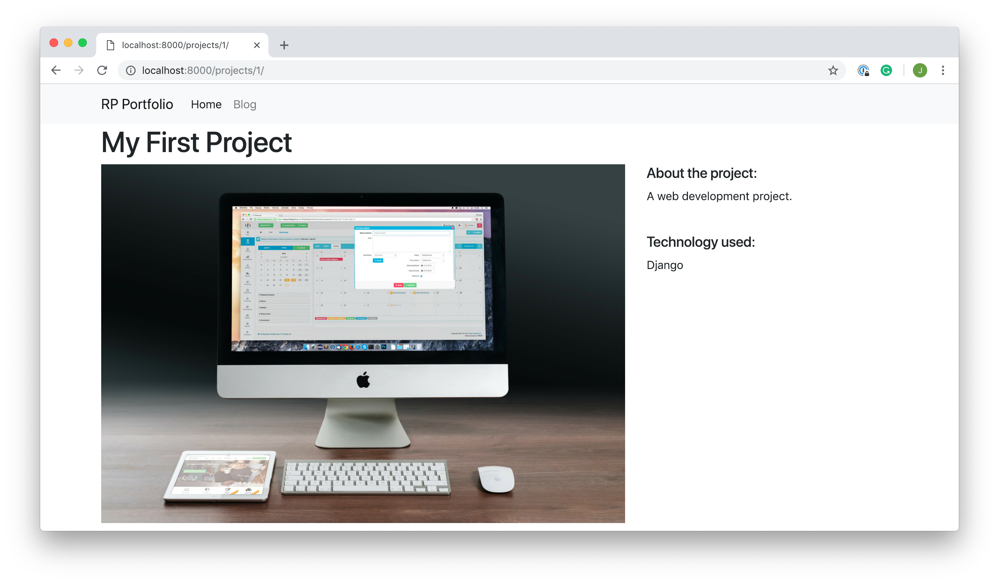
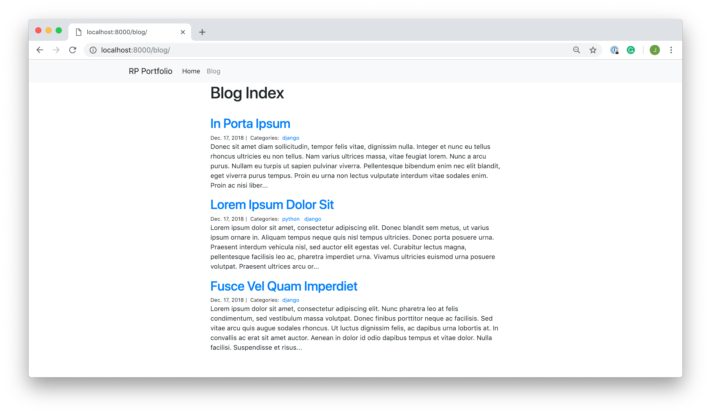
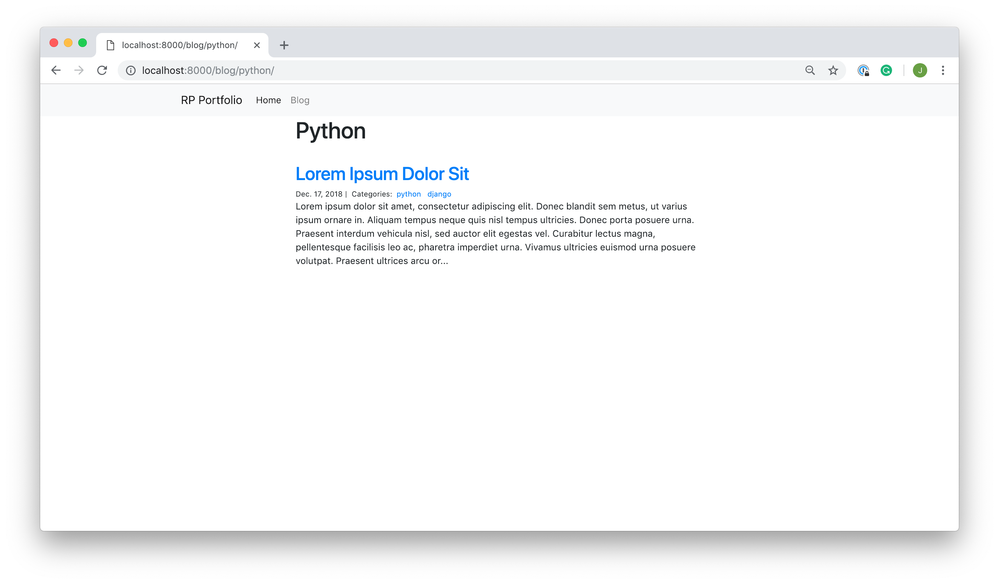
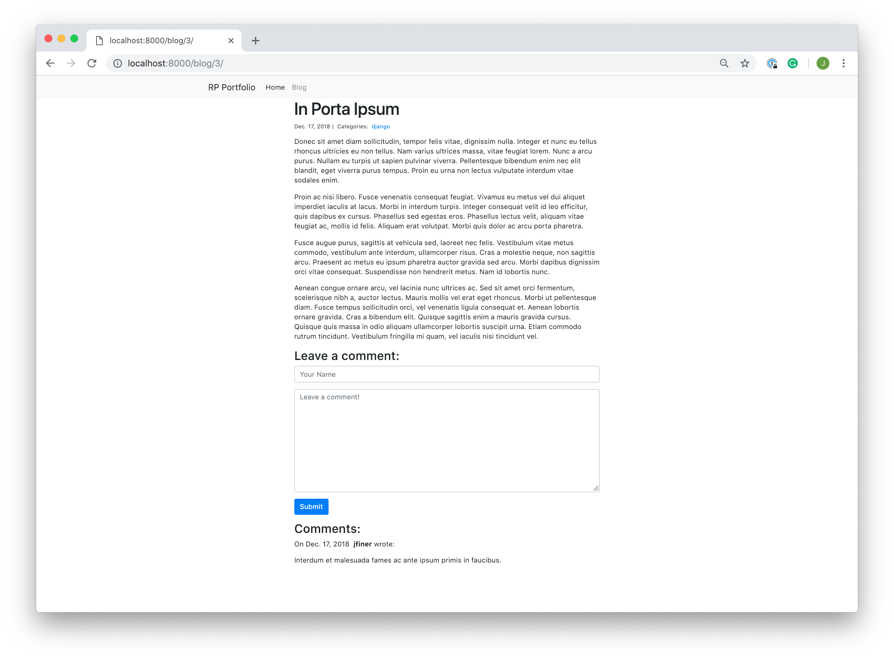

# Un portafolio personal

## Proyecto 1: Hello World

### Set Up Your Development Environment

- Create a new directory `portfolio` for your project to live in, and `cd` into it.

- Once you are inside the main directory, create a virtual environment to manage dependencies. 

- Now that you’ve created a virtual environment, it’s time to install Django. 

- Once you’ve set up the virtual environment and installed Django, you can now dive in to creating the application.

### Create a Django Project

- Create the project `portfolio_project`.
- Create the `templates` directory and add its location to the `settings.py` file.

- Your directory structure should look something like this:

```bash
portfolio/
├── portfolio_project/
│   ├── __init__.py
│   ├── settings.py
│   ├── urls.py
│   └── wsgi.py
├── templates
├── Pipfile
├── Pipfile.lock
└── manage.py
```

- Once your file structure is set up, you can now start the server and  check that your set up was successful. 
- Then, in your browser go to `localhost:8000`, and you should see the following:



- Congratulations, you’ve created a Django site! 

- The next step is to create apps so that you can add views and functionality to your site.

### Create a Django Application

For this part, we’ll create an app called `hello_world`, which you’ll subsequently delete as its not necessary for our personal portfolio site.

- Create the app `hello_world`.
- Once you’ve created the app, you need to install it in your project on the ` settings.py` file. 
- The next step is to create a view so that you can display something to a user.

### Create a View

- Navigate to the `views.py` file in the `hello_world` directory. There’s already a line of code in there that imports `render()`. Add the following code:

```
from django.shortcuts import render

def hello_world(request):
    return render(request, 'hello_world.html', {})
```

- Now that you’ve created the view function, you need to create the HTML template to display to the user. `render()` looks for HTML templates inside a directory called `templates` and create the file `hello_world.html`.
- Add the following lines of HTML to your file:

```
<h1>Hello, World!</h1>
```

- The final step is to hook up your URLs so that you can visit the page you’ve just created. Your project has a module called `urls.py` in which you need to include a URL configuration for the `hello_world` app. Inside `portfolio_project/urls.py`, add the following:

```
from django.contrib import admin
from django.urls import path, include

urlpatterns = [
    path('admin/', admin.site.urls),
    path('', include('hello_world.urls')),
]
```

- The `hello_world.urls` module doesn’t exist yet, so you’ll need to create it:

```
$ touch hello_world/urls.py
```

- Inside this module, we need to import the path object as well as our app’s `views` module. Then we want to create a list of URL patterns that correspond  to the various view functions. At the moment, we have only created one view function, so we need only create one URL:

```
from django.urls import path
from hello_world import views

urlpatterns = [
    path('', views.hello_world, name='hello_world'),
]
```

Now, when you restart the server and visit `localhost:8000`, you should be able to see the HTML template you created:

[](https://files.realpython.com/media/Screenshot_2018-12-09_at_17.57.22.f3c9ea711bd4.png)

### Add Bootstrap to Your App

Before we get started with the Bootstrap styles, we’ll create a `base.html` template that we can import to each subsequent view. This template is  where we’ll subsequently add the Bootstrap style imports.

- Inside this new file add the following lines of code:

```

```

Now, in `hello_world.html` template, we can extend it:

```



<h1>Hello, World!</h1>

```

- To install Bootstrap in your app, you’ll use the [Bootstrap CDN](https://getbootstrap.com/docs/4.1/getting-started/introduction/#quick-start). This is a really simple way to install Bootstrap that just involves adding a few lines of code to `base.html`. 
- Now, when you visit `localhost:8000`, you should see that the page has been formatted with slightly different styling:



- Es tiempo de poner en producción lo que has hecho hasta ahora.

  - Consolidar el proyecto en un repositorio público de GitHub.

  - Publicar el proyecto en Heroku.

  - IMPORTANTE: Publicar la URL de Heroku en Moodle para su evaluación.

## Proyecto 2: Projects
- Clona el proyecto anterior en un nuevo directorio para seguir introduciendo cambios.


## Showcase Your Projects

Any web developer looking to create a portfolio needs a way to show off projects they have worked on. That’s what you’ll be building now.  You’ll create another Django app called `projects` that will hold a series of sample projects that will be displayed to the user.  Users can click on projects and see more information about your work.

- Before we build the `projects` app, let’s first delete the `hello_world` application. All you need to do is delete the `hello_world` directory and remove the line `"hello_world",` from `INSTALLED_APPS`.
- Finally, you need to remove the URL path created in `portfolio_project/urls.py`.
- Now that you’ve removed the `hello_world` app, we can create the `projects` app. 
- This will create a directory named `projects`. The files created are the same as those created when we set up the `hello_world` application. In order to hook up our app, we need to add it into `INSTALLED_APPS`.
- We’re not going to worry about URLs for  this application just yet. Instead, we’re going to focus on building a `Project` model.

### Projects App: Models

In your projects app, you’ll only need one table to store the  different projects you’ll display to the user. That means you’ll only  need to create one model in `models.py`.

The model you’ll create will be called `Project` and will have the following fields:

- **`title`** will be a short string field to hold the name of your project.
- **`description`** will be a larger string field to hold a longer piece of text.
- **`technology`** will be a string field, but its contents will be limited to a select number of choices.
- **`image`** will be an image field that holds the file path where the image is stored.

- Create this model:

```
from django.db import models

class Project(models.Model):
    title = models.CharField(max_length=100)
    description = models.TextField()
    technology = models.CharField(max_length=20)
    image = models.FilePathField(path="/img")
```

`CharField` is used for short strings and specifies a maximum length.

`TextField` is similar to `CharField` but can be used for longer form text as it doesn’t have a maximum length limit. Finally, `FilePathField` also holds a string but must point to a file path name.

- Realiza las pertinentes migraciones asegurándote de ponerle un nombre, `projects`.


**Note:** When running both the `makemigrations` and `migrate` commands, we added `projects` to our command. This tells Django to only look at models and migrations in the `projects` app. Django comes with several models already created.

If you run yout migrations without the `projects` flag, then all migrations for all the default models in your Django  projects will be created and applied. This is not a problem, but for the purposes of this section, they are not needed.

- To create instances of our `Project` class, we’re going to have to use the Django shell. The Django shell is similar to the Python shell but allows you to access the database and create entries. To access the Django shell, we use another Django management command:

```
$ python manage.py shell
```

Once you’ve accessed the shell, you’ll notice that the command prompt will change from `$` to `>>>`. You can then import your models:

```
>>> from projects.models import Project
```

We’re first going to create a new project with the following attributes:

- **`name`:** `My First Project`
- **`description`:** `A web development project.`
- **`technology`:** `Django`
- **`image`:** `img/project1.png`

To do this, we create an instance of the Project class in the Django shell:

```
>>> p1 = Project(
...     title='My First Project',
...     description='A web development project.',
...     technology='Django',
...     image='img/project1.png'
... )
>>> p1.save()
```

This creates a new entry in your projects table and saves it to the  database. Now you have created a project that you can display on your portfolio site.

The final step in this section is to create two more sample projects:

```
>>> p2 = Project(
...     title='My Second Project',
...     description='Another web development project.',
...     technology='Flask',
...     image='img/project2.png'
... )
>>> p2.save()
>>> p3 = Project(
...     title='My Third Project',
...     description='A final development project.',
...     technology='Django',
...     image='img/project3.png'
... )
>>> p3.save()
```


## Projects App: Views

Now you’ve created the projects to display on your portfolio site,  you’ll need to create view functions to send the data from the database  to the HTML templates.

In the `projects` app, you’ll create two different views:

1. An index view that shows a snippet of information about each project
2. A detail view that shows more information on a particular topic

Let’s start with the index view:
```
from django.shortcuts import render
from projects.models import Project

def project_index(request):
    projects = Project.objects.all()
    context = {
        'projects': projects
    }
    return render(request, 'project_index.html', context)
```

- We  render a template named `project_index.html`, which doesn’t exist yet. Don’t worry about that for now. You’ll create the templates for these views in the next section.

- Next, you’ll need to create the `project_detail()` view function. This function will need an additional argument: the id of the project that’s being viewed.

```
def project_detail(request, pk):
    project = Project.objects.get(pk=pk)
    context = {
        'project': project
    }
    return render(request, 'project_detail.html', context)
```

- Once your view functions are created, we need to hook them up to URLs. We’ll start by creating a file `projects/urls.py` to hold the URL configuration for the app. This file should contain the following code:

```
from django.urls import path
from . import views

urlpatterns = [
    path("", views.project_index, name="project_index"),
    path("<int:pk>/", views.project_detail, name="project_detail"),
]
```

- With those now set up, we need to hook these URLs up to the project URLs. In `personal_portfolio/urls.py`, add the following highlighted line of code:

```
    path("", include("projects.urls")),
```

There are now two full URLs that can be accessed with our project:

- **`localhost:8000/:** The project index page
- **`localhost:8000/3`:** The detail view for the project with `pk=3`

These URLs still won’t work properly because we don’t have any HTML templates. 

### Projects App: Templates

Our final step is to create two templates:

1. The `project_index` template
2. The `project_detail` template 

As we’ve added Bootstrap styles to our application, we can use some  pre-styled components to make the views look nice. Let’s start with the `project_index` template.

- Add the following code to a file named `project_index.html`:

```



<h1>Projects</h1>
<div class="row">

    <div class="col-md-4">
        <div class="card mb-2">
            
            <div class="card-body">
                <h5 class="card-title">{{ project.title }}</h5>
                <p class="card-text">{{ project.description }}</p>
                <a href=""
                   class="btn btn-primary">
                    Read More
                </a>
            </div>
        </div>
    </div>
    
</div>

```


Django automatically registers static files stored in a directory named `static/` in each application. Our image file path names were of the structure: `img/<photo_name>.png`.

- When loading static files, Django looks in the `static/` directory for files matching a given filepath within `static/`. So, we need to create a directory named `static/` with another directory named `img/` inside with the three `.png` files.

With all that in place, if you start the Django server and visit `localhost:8000/projects`, then you should see something like this:



- Time to create the `project_detail.html` template. The code for this template is below:

```




<h1>{{ project.title }}</h1>
<div class="row">
    <div class="col-md-8">
        
    </div>
    <div class="col-md-4">
        <h5>About the project:</h5>
        <p>{{ project.description }}</p>
        <br>
        <h5>Technology used:</h5>
        <p>{{ project.technology }}</p>
    </div>
</div>

```

- If you visit `localhost:8000/projects/1`, you should see the detail page for that first project you created:



- Es tiempo de poner en producción lo que has hecho hasta ahora.

  - Consolidar el proyecto en un repositorio público de GitHub.

  - Publicar el proyecto en Heroku.

  - IMPORTANTE: Publicar la URL de Heroku en Moodle para su evaluación.

## Proyecto 3: Blog

- Clona el proyecto anterior en un nuevo directorio para seguir introduciendo cambios.


## Share Your Knowledge With a Blog

A blog is a great addition to any personal portfolio site. Whether you update it monthly or weekly, it’s a great place to share your  knowledge as you learn. In this section, you’re going to build a fully  functioning blog that will allow you to perform the following tasks:

- Create, update, and delete blog posts
- Display posts to the user as either an index view or a detail view
- Assign categories to posts
- Allow users to comment on posts

You’ll also use the Django Admin interface, which is  where you’ll create, update, and delete posts and categories as necessary.

- Before you get into building out the functionality of this part of your site, create a new Django app named `blog`. Don’t delete `projects`. You’ll want both apps in your Django project. Don’t forget to add `blog` to your `INSTALLED_APPS`.

Hold off on hooking up the URLs for now. As with the `projects` app, you’ll start by adding your models.

### Blog App: Models

The `models.py` file in this app is much more complicated than in the `projects` app.

You’re going to need three separate database tables for the blog: 

1. `Post`
2. `Category`
3. `Comment`

These tables need to be related to one another. This is made easier because Django models come with fields specifically for this purpose.

Below is the code for the `Category` and `Post` models:

```
from django.db import models

class Category(models.Model):
    name = models.CharField(max_length=20)

class Post(models.Model):
    title = models.CharField(max_length=255)
    body = models.TextField()
    created_on = models.DateTimeField(auto_now_add=True)
    last_modified = models.DateTimeField(auto_now=True)
    categories = models.ManyToManyField('Category', related_name='posts')
```

`created_on` and `last_modified`, are Django `DateTimeFields`. These store a [`datetime`](https://docs.python.org/3.7/library/datetime.html) object containing the date and time when the post was created and modified respectively.

The `DateTimeField` takes an argument `auto_now_add=True`. This assigns the current date and time to this field whenever an instance of this class is created.

The `DateTimeField` takes an argument `auto_now=True`. This assigns the current date and time to this field whenever an  instance of this class is saved. That means whenever you edit an instance of this class, the `date_modified` is updated.

The final field on the post model is the most interesting. We want to link our models for categories and posts in such a way that *many* categories can be assigned to *many* posts. Luckily, Django makes this easier for us by providing a `ManytoManyField` field type. This field links the `Post` and `Category` models and allows us to create a relationship between the two tables.

The `ManyToManyField` takes two arguments. The first is the model with which the relationship is, in this case its `Category`. The second allows us to access the relationship from a `Category` object, even though we haven’t added a field there. By adding a `related_name` of `posts`, we can access `category.posts` to give us a list of posts with that category.

The third and final model we need to add is `Comment`. We’ll use another relationship field similar the `ManyToManyField` that relates `Post` and `Category`. However, we only want the relationship to go one way: one post should have many comments.

- You’ll see how this works after we define the `Comment` class:

```
class Comment(models.Model):
    author = models.CharField(max_length=60)
    body = models.TextField()
    created_on = models.DateTimeField(auto_now_add=True)
    post = models.ForeignKey('Post', on_delete=models.CASCADE)
```

The first three fields on this model should look familiar. There’s an `author` field for users to add a name or alias, a `body` field for the body of the comment, and a `created_on` field that is identical to the `created_on` field on the `Post` model.

We use another relational field, the `ForeignKey` field. This is similar to the `ManyToManyField` but instead defines a **many to one** relationship. The reasoning behind this is that **many** comments can be assigned to **one** post. But you can’t have a comment that corresponds to many posts.

The `ForeignKey` field takes two arguments. The first is the other model in the relationship, in this case, `Post`. The second tells Django what to do when a post is deleted. If a post is deleted, then we don’t want the comments related to it hanging around.  We, therefore, want to delete them as well, so we add the argument `on_delete=models.CASCADE`.

- Once you’ve created the models, you can create the migration files

Now that you’ve created the models, we can start to add some posts and categories. You won’t be doing this from the command line as you did with the projects, as typing out a whole blog post into the command  line would be unpleasant to say the least! 

Instead, you’ll use the Django Admin, which will allow  you to create instances of your model classes in a nice web interface.

### Blog App: Django Admin

- Before you can access the admin, you need to add yourself as a superuser, so create it. 
- Navigate to `localhost:8000/admin` and log in with the credentials you just used to create a superuser. 
- In the `blog` directory, open the file `admin.py` and type the following lines of code:

```
from django.contrib import admin
from blog.models import Post, Category

class PostAdmin(admin.ModelAdmin):
    pass

class CategoryAdmin(admin.ModelAdmin):
    pass

admin.site.register(Post, PostAdmin)
admin.site.register(Category, CategoryAdmin)
```

If you wanted to add a feature where comments are moderated, then go ahead and add the Comments model too. The steps to do so are exactly the same!

- Create a couple of fake posts and assign them fake categories before moving onto the next section. That way, you’ll have posts you can view  when we create our templates.

### Blog App: Views

You’ll need to create three view functions in the `views.py` file in the `blog` directory:

- **`blog_index`** will display a list of all your posts.
- **`blog_detail`** will display the full post as well as comments and a form to allow users to create new comments.
- **`blog_category`** will be similar to `blog_index`, but the posts viewed will only be of a specific category chosen by the user.

The simplest view function to start with is `blog_index()`. 

```
from django.shortcuts import render
from blog.models import Post, Comment

def blog_index(request):
    posts = Post.objects.all().order_by('-created_on')
    context = {
        "posts": posts,
    }
    return render(request, "blog_index.html", context)
```

You import the `Post` and the `Comment` models, and on **line 5** inside the view function, you obtain a Queryset containing all the posts in the database. `order_by()` orders the Queryset according to the argument given. The minus sign tells Django to start with the largest value rather than the smallest.  We use this, as we want the posts to be ordered with the most recent  post first.

Finally, you define the `context` dictionary and render the template. Don’t worry about creating it yet. You’ll get to creating those in the next section.

- Next, you can start to create the `blog_category()` view. The view function will need to take a category name as an argument and query the `Post` database for all posts that have been assigned the given category:

```
def blog_category(request, category):
    posts = Post.objects.filter(
        categories__name__contains=category
    ).order_by(
        '-created_on'
    )
    context = {
        "category": category,
        "posts": posts
    }
    return render(request, "blog_category.html", context)
```

You’ve used a [Django Queryset filter](https://docs.djangoproject.com/en/2.1/topics/db/queries/#retrieving-specific-objects-with-filters). The argument of the filter tells Django what conditions need to be met for an object to be retrieved. In this case, we only want posts whose categories contain the category with the name corresponding to that  given in the argument of the view function. Again, you’re using `order_by()` to order posts starting with the most recent.

We then add these posts and the category to the `context` dictionary, and render our template.

- The last view function to add is `blog_detail()`. This is  more complicated as we are going to include a form. Before you add the form, just set up the view function to show a specific post with a comment associated with it. This function will be almost equivalent to  the `project_detail()` view function in the `projects` app:

```
def blog_detail(request, pk):
    post = Post.objects.get(pk=pk)
    comments = Comment.objects.filter(post=post)
    context = {
        "post": post,
        "comments": comments,
    }

    return render(request, "blog_detail.html", context)
```

The view function takes a `pk` value as an argument and, on **line 22**, retrieves the object with the given `pk`.

We retrieve all the comments assigned to the given post using Django filters again.

Lastly, add both `post` and `comments` to the `context` dictionary and render the template.

- To add a form to the page, you’ll need to create another file in the `blog` directory named `forms.py`. Django forms are very similar to models. A form consists of a class  where the class attributes are form fields. Django comes with some  built-in form fields that you can use to quickly create the form you  need.

For this form, the only fields you’ll need are `author`, which should be a `CharField`, and `body`, which can also be a `CharField`.

**Note:** If the `CharField` of your form corresponds to a model `CharField`, make sure both have the same `max_length` value.

- `blog/forms.py` should contain the following code:

```python
from django import forms

class CommentForm(forms.Form):
    author = forms.CharField(
        max_length=60,
        widget=forms.TextInput(attrs={
            "class": "form-control",
            "placeholder": "Your Name"
        })
    )
    body = forms.CharField(widget=forms.Textarea(
        attrs={
            "class": "form-control",
            "placeholder": "Leave a comment!"
        })
    )
```

You’ll also notice an argument `widget` has been passed to both the fields. The `author` field has the `forms.TextInput` widget. This tells Django to load this field as an HTML text input element in the templates. The `body` field uses a `forms.TextArea` widget instead, so that the field is rendered as an HTML text area element.

These widgets also take an argument `attrs`, which is a dictionary and allows us to specify some CSS classes, which will help  with formatting the template for this view later. It also allows us to add some placeholder text.

When a form is posted, a `POST` request is sent to the server. So, in the view function, we need to check if a `POST` request has been received. We can then create a comment from the form fields. Django comes with a handy `is_valid()` on its forms, so we can check that all the fields have been entered correctly.

- Once you’ve created the comment from the form, you’ll need to save it using `save()` and then query the database for all the comments assigned to the given  post. Your view function should contain the following code:

```
def blog_detail(request, pk):
    post = Post.objects.get(pk=pk)

    form = CommentForm()
    if request.method == 'POST':
        form = CommentForm(request.POST)
        if form.is_valid():
            comment = Comment(
                author=form.cleaned_data["author"],
                body=form.cleaned_data["body"],
                post=post
            )
            comment.save()

    comments = Comment.objects.filter(post=post)
    context = {
        "post": post,
        "comments": comments,
        "form": form,
    }
    return render(request, "blog_detail.html", context)
```

- We create an instance of our form class. Don’t forget to import your form at the beginning of the file:

```
from .forms import CommentForm
```

We then go on to check if a `POST` request has been received. If it has, then we create a new instance of our form, populated with the data entered into the form.

The form is then validated using `is_valid()`. If the form is valid, a new instance of `Comment` is created. You can access the data from the form using `form.cleaned_data`, which is a dictionary.

They keys of the dictionary correspond to the form fields, so you can access the author using `form.cleaned_data['author']`. Don’t forget to add the current post to the comment when you create it.

**Note:** The life cycle of submitting a form can be a little complicated, so here’s an outline of how it works:

1. When a user visits a page containing a form, they send a `GET` request to the server. In this case, there’s no data entered in the form, so we just want to render the form and display it.

2. When a user enters information and clicks the Submit  button, a `POST`request, containing the data submitted with the form, is sent to the  server. At this point, the data must be processed, and two things can happen:

   - The form is valid, and the user is redirected to the next page.
   - The form is invalid, and empty form is once again displayed. The user is back at step 1, and the process repeats.

Next, we save the comment and go on to add the `form` to the `context` dictionary so you can access the form in the HTML template.

The final step before you get to create the templates and actually  see this blog up and running is to hook up the URLs.
- You’ll need create another `urls.py` file inside `blog/` and add the URLs for the three views:

```
from django.urls import path
from . import views

urlpatterns = [
    path("", views.blog_index, name="blog_index"),
    path("<int:pk>/", views.blog_detail, name="blog_detail"),
    path("<category>/", views.blog_category, name="blog_category"),
]
```

Once the blog-specific URLs are in place, you need to add them to the projects URL configuration using `include()`:

```
from django.contrib import admin
from django.urls import path, include

urlpatterns = [
    path("admin/", admin.site.urls),
    path("projects/", include("projects.urls")),
    path("blog/", include("blog.urls")),
]
```

With this set up, all the blog URLs will be prefixed with `blog/`, and you’ll have the following URL paths:

- **`localhost:8000/blog`:** Blog index
- **`localhost:8000/blog/1`:** Blog detail view of blog with `pk=1`
- **`localhost:8000/blog/python`:** Blog index view of all posts with category `python`

### Blog App: Templates

The final piece of our blog app is the templates. By the end of this section, you’ll have created a fully functioning blog.

You’ll notice there are some bootstrap elements included in the  templates to make the interface prettier. 

The first template you’ll create is for the blog index in a new file `blog/templates/blog_index.html`. This will be very similar to the projects index view.

You’ll use a for loop to loop over all the posts. For each post,  you’ll display the title and a snippet of the body. As always, you’ll extend the base template `porfolio/templates/base.html`, which contains our navigation bar and some extra formatting:

```


<div class="col-md-8 offset-md-2">
    <h1>Blog Index</h1>
    <hr>
    
    <h2><a href="">{{ post.title }}</a></h2>
    <small>
        {{ post.created_on.date }} |&nbsp;
        Categories:&nbsp;
        
        <a href="">
            {{ category.name }}
        </a>&nbsp;
        
    </small>
    <p>{{ post.body | slice:":400" }}...</p>
    
</div>

```

We have the post title, which is a hyperlink. The link is a Django link where we are pointing to the URL named `blog_detail`, which takes an integer as its argument and should correspond to the `pk` value of the post.

Underneath the title, we’ll display the `created_on` attribute of the post as well as its categories. We use another for loop to loop over all the categories assigned to the post.

We use a **template filter** [`slice`](https://docs.djangoproject.com/en/2.1/ref/templates/builtins/#slice) to cut off the post body at 400 characters so that the blog index is more readable.

Once that’s in place, you should be able to access this page by visiting `localhost:8000/blog`:



Next, create another HTML file `templates/blog_category.html` where your `blog_category` template will live. This should be identical to `blog_index.html`, except with the category name inside the `h1` tag instead of `Blog Index`:

```


<div class="col-md-8 offset-md-2">
    <h1>{{ category | title }}</h1>
    <hr>
    
        <h2><a href="">{{ post.title }}</a></h2>
        <small>
            {{ post.created_on.date }} |&nbsp;
            Categories:&nbsp;
            
            <a href="">
                {{ category.name }}
            </a>&nbsp;
            
        </small>
        <p>{{ post.body | slice:":400" }}...</p>
    
</div>

```

Most of this template is identical to the previous template. The only difference is that we use another Django template filter [`title`](https://docs.djangoproject.com/en/2.1/ref/templates/builtins/#title). This applies titlecase to the string and makes words start with an uppercase character.

With that template finished, you’ll be able to access your category view. If you defined a category named `python`, you should be able to visit `localhost:8000/blog/python` and see all the posts with that category:



The last template to create is the `blog_detail` template. In this template, you’ll display the title and full body of a post.

Between the title and the body of the post, you’ll display the date  the post was created and any categories. Underneath that, you’ll include a comments form so users can add a new comment. Under this, there will  be a list of comments that have already been left:

```


<div class="col-md-8 offset-md-2">
    <h1>{{ post.title }}</h1>
    <small>
        {{ post.created_on.date }} |&nbsp;
        Categories:&nbsp;
        
        <a href="">
            {{ category.name }}
        </a>&nbsp;
        
    </small>
    <p>{{ post.body | linebreaks }}</p>
    <h3>Leave a comment:</h3>
    <form action="/blog/{{ post.pk }}/" method="post">
        
        <div class="form-group">
            {{ form.author }}
        </div>
        <div class="form-group">
            {{ form.body }}
        </div>
        <button type="submit" class="btn btn-primary">Submit</button>
    </form>
    <h3>Comments:</h3>
    
    <p>
        On {{comment.created_on.date }}&nbsp;
        <b>{{ comment.author }}</b> wrote:
    </p>
    <p>{{ comment.body }}</p>
    <hr>
    
</div>

```

The first few lines of the template in which we display the post  title, date, and categories is the same logic as for the previous  templates. This time, when rendering the post body, use a [`linebreaks`](https://docs.djangoproject.com/en/2.1/ref/templates/builtins/#linebreaks) template filter. This tag registers line breaks as new paragraphs, so the body doesn’t appear as one long block of text.

Underneath the post you’ll display your form. The form action points to the URL path of the page to which you’re sending the `POST` request to. In this case, it’s the same as the page that is currently being visited. You then add a `csrf_token`, which provides security and renders the body and author fields of the form, followed by a submit button.

To get the bootstrap styling on the author and body fields, you need to add the `form-control` class to the text inputs.

Because Django renders the inputs for you when you include `{{ form.body }}` and `{{ form.author }}`, you can’t add these classes in the template. That’s why you added the attributes to the form widgets in the previous section.

Underneath the form, there’s another for loop that loops over all the comments on the given post. The comments, `body`, `author`, and `created_on` attributes are all displayed.

Once that template is in place, you should be able to visit `localhost:8000/blog/1` and view your first post:



You should also be able to access the post detail pages by clicking on their title in the `blog_index` view.

The final finishing touch is to add a link to the `blog_index` to the navigation bar in `base.html`. This way, when you click on *Blog* in the navigation bar, you’ll be able to visit the blog.

